# **Predicting Charged-Off Loans with LendingClub Data**

# Table of Contents
1. [Introduction](#intro)
2. [Import the data](#importdata)
3. [Target Variable](#targetvariable)
4. [Feature Selection I: EDA](#featureselection)  
    4.1 [Drop features missing too much data](#missing_data)  
    4.2 [Remove "cheat" data](#cheat_data)  
    4.3 [Inspect the remaining features one by one](#inspect)  
5. [Feature Section II: (Linear) correlation between (numerical) features](#corr)   
    5.1 [Convert target variable to 0/1 indicator](#converttarget)   
    5.2 [K-S test](#kstest)   
    5.3 [Pearson Correlation](#pearson)   
6. [Feature Engineering](#featureeng)  
    6.1 [Dummy variables](#dummies)  
    6.2 [Train/Test data split](#split)  
    6.3 [Imputing missing values](#imputing)  
    6.4 [Feature Scaling](#scaling)  
    6.5 [PCA visualization of the train data](#pca)   
    6.6 [Linear dependence of Charged-Off](#pearson2)
7. [Modeling](#modeling)  
    7.1 [Logistic Regression with SGD](#logreg)  
    7.2 [Random Forest](#rf)   
    7.3 [KNN](#knn)  
    7.4 [Hyperparameter tuning on the best model](#hyper)  
    7.5 [Evaluate the best model on the testing set](#evaluate)  
8. [Further understanding the model](#understanding)
9. [Conclusion](#conclusion)

Additionally: 
[MyGitHub](https://github.com/yanxiali)


```python
# Imports
import os
import pandas as pd
from pandas import Series, DataFrame
import pandas_profiling

pd.set_option('display.max_rows', None,'display.max_columns', None)

import numpy as np
import matplotlib.pyplot as plt
import seaborn as sns
sns.set_style('whitegrid')
%matplotlib inline

from collections import Counter

from sklearn.linear_model import LogisticRegression
from sklearn.svm import SVC, LinearSVC
from sklearn.ensemble import RandomForestClassifier, AdaBoostClassifier, GradientBoostingClassifier, ExtraTreesClassifier, VotingClassifier
from sklearn.discriminant_analysis import LinearDiscriminantAnalysis
from sklearn.neighbors import KNeighborsClassifier
from sklearn.naive_bayes import GaussianNB
from sklearn.tree import DecisionTreeClassifier
from sklearn.neural_network import MLPClassifier
from sklearn.model_selection import GridSearchCV, cross_val_score, StratifiedKFold, learning_curve, cross_validate
from sklearn.metrics import confusion_matrix, precision_score, recall_score, f1_score, make_scorer

from scipy.stats import ks_2samp
from treeinterpreter import treeinterpreter as ti

from sklearn.preprocessing import Imputer, StandardScaler
from sklearn import cross_validation
from sklearn import metrics

"""
from sklearn import metrics
from sklearn import linear_model

from sklearn import tree
from sklearn import svm
from sklearn import ensemble
from sklearn import neighbors
from sklearn import preprocessing
"""

# ignore Deprecation Warning
import warnings
#warnings.filterwarnings("ignore", category=DeprecationWarning,RuntimeWarning) 
warnings.filterwarnings("ignore") 

#plt.style.use('fivethirtyeight') # Good looking plots
pd.set_option('display.max_columns', None) # Display any number of columns

```

    /Users/yanxia/anaconda3/lib/python3.6/site-packages/sklearn/cross_validation.py:41: DeprecationWarning: This module was deprecated in version 0.18 in favor of the model_selection module into which all the refactored classes and functions are moved. Also note that the interface of the new CV iterators are different from that of this module. This module will be removed in 0.20.
      "This module will be removed in 0.20.", DeprecationWarning)


## 1. Introduction
<a id="intro"></a>
The objective is to use the loan data to build a model that can predict the loan status (whether or not a loan will be fully paid or charged off) and interpret the results to find the factors which affect the result.  

We want to develop a model that is **accurate** and **interpretable**.

This problem is a binary classification as I have only two classes to predict.

## 2. Data
<a id="importdata"></a>

In this project, I will work with the publicly available Lending Club data on [Kaggle](https://www.kaggle.com/wordsforthewise/lending-club). 
The dataset is 1.8+ GB of size, including 1.6 millions of loans from 2007 to 2017Q, each of which has 150 associated features. 


```python
df = pd.read_csv('../input/accepted_2007_to_2017Q3.csv.gz',compression='gzip',low_memory=True)
#df = pd.read_csv('../input/accepted_2017.csv.gz',compression='gzip',low_memory=True)
```


```python
df.info()
```

    <class 'pandas.core.frame.DataFrame'>
    RangeIndex: 1646801 entries, 0 to 1646800
    Columns: 150 entries, id to settlement_term
    dtypes: float64(113), object(37)
    memory usage: 1.8+ GB


```python
df.sample(5)
```


<div>
<style scoped>
    .dataframe tbody tr th:only-of-type {
        vertical-align: middle;
    }

    .dataframe tbody tr th {
        vertical-align: top;
    }

    .dataframe thead th {
        text-align: right;
    }
</style>
<table border="1" class="dataframe">
  <thead>
    <tr style="text-align: right;">
      <th></th>
      <th>id</th>
      <th>member_id</th>
      <th>loan_amnt</th>
      <th>funded_amnt</th>
      <th>funded_amnt_inv</th>
      <th>term</th>
      <th>int_rate</th>
      <th>installment</th>
      <th>grade</th>
      <th>sub_grade</th>
      <th>emp_title</th>
      <th>emp_length</th>
      <th>home_ownership</th>
      <th>annual_inc</th>
      <th>verification_status</th>
      <th>issue_d</th>
      <th>loan_status</th>
      <th>pymnt_plan</th>
      <th>desc</th>
      <th>purpose</th>
      <th>title</th>
      <th>zip_code</th>
      <th>addr_state</th>
      <th>dti</th>
      <th>delinq_2yrs</th>
      <th>earliest_cr_line</th>
      <th>fico_range_low</th>
      <th>fico_range_high</th>
      <th>inq_last_6mths</th>
      <th>mths_since_last_delinq</th>
      <th>mths_since_last_record</th>
      <th>open_acc</th>
      <th>pub_rec</th>
      <th>revol_bal</th>
      <th>revol_util</th>
      <th>total_acc</th>
      <th>initial_list_status</th>
      <th>out_prncp</th>
      <th>out_prncp_inv</th>
      <th>total_pymnt</th>
      <th>total_pymnt_inv</th>
      <th>total_rec_prncp</th>
      <th>total_rec_int</th>
      <th>total_rec_late_fee</th>
      <th>recoveries</th>
      <th>collection_recovery_fee</th>
      <th>last_pymnt_d</th>
      <th>last_pymnt_amnt</th>
      <th>next_pymnt_d</th>
      <th>last_credit_pull_d</th>
      <th>last_fico_range_high</th>
      <th>last_fico_range_low</th>
      <th>collections_12_mths_ex_med</th>
      <th>mths_since_last_major_derog</th>
      <th>policy_code</th>
      <th>application_type</th>
      <th>annual_inc_joint</th>
      <th>dti_joint</th>
      <th>verification_status_joint</th>
      <th>acc_now_delinq</th>
      <th>tot_coll_amt</th>
      <th>tot_cur_bal</th>
      <th>open_acc_6m</th>
      <th>open_act_il</th>
      <th>open_il_12m</th>
      <th>open_il_24m</th>
      <th>mths_since_rcnt_il</th>
      <th>total_bal_il</th>
      <th>il_util</th>
      <th>open_rv_12m</th>
      <th>open_rv_24m</th>
      <th>max_bal_bc</th>
      <th>all_util</th>
      <th>total_rev_hi_lim</th>
      <th>inq_fi</th>
      <th>total_cu_tl</th>
      <th>inq_last_12m</th>
      <th>acc_open_past_24mths</th>
      <th>avg_cur_bal</th>
      <th>bc_open_to_buy</th>
      <th>bc_util</th>
      <th>chargeoff_within_12_mths</th>
      <th>delinq_amnt</th>
      <th>mo_sin_old_il_acct</th>
      <th>mo_sin_old_rev_tl_op</th>
      <th>mo_sin_rcnt_rev_tl_op</th>
      <th>mo_sin_rcnt_tl</th>
      <th>mort_acc</th>
      <th>mths_since_recent_bc</th>
      <th>mths_since_recent_bc_dlq</th>
      <th>mths_since_recent_inq</th>
      <th>mths_since_recent_revol_delinq</th>
      <th>num_accts_ever_120_pd</th>
      <th>num_actv_bc_tl</th>
      <th>num_actv_rev_tl</th>
      <th>num_bc_sats</th>
      <th>num_bc_tl</th>
      <th>num_il_tl</th>
      <th>num_op_rev_tl</th>
      <th>num_rev_accts</th>
      <th>num_rev_tl_bal_gt_0</th>
      <th>num_sats</th>
      <th>num_tl_120dpd_2m</th>
      <th>num_tl_30dpd</th>
      <th>num_tl_90g_dpd_24m</th>
      <th>num_tl_op_past_12m</th>
      <th>pct_tl_nvr_dlq</th>
      <th>percent_bc_gt_75</th>
      <th>pub_rec_bankruptcies</th>
      <th>tax_liens</th>
      <th>tot_hi_cred_lim</th>
      <th>total_bal_ex_mort</th>
      <th>total_bc_limit</th>
      <th>total_il_high_credit_limit</th>
      <th>revol_bal_joint</th>
      <th>sec_app_fico_range_low</th>
      <th>sec_app_fico_range_high</th>
      <th>sec_app_earliest_cr_line</th>
      <th>sec_app_inq_last_6mths</th>
      <th>sec_app_mort_acc</th>
      <th>sec_app_open_acc</th>
      <th>sec_app_revol_util</th>
      <th>sec_app_open_act_il</th>
      <th>sec_app_num_rev_accts</th>
      <th>sec_app_chargeoff_within_12_mths</th>
      <th>sec_app_collections_12_mths_ex_med</th>
      <th>sec_app_mths_since_last_major_derog</th>
      <th>hardship_flag</th>
      <th>hardship_type</th>
      <th>hardship_reason</th>
      <th>hardship_status</th>
      <th>deferral_term</th>
      <th>hardship_amount</th>
      <th>hardship_start_date</th>
      <th>hardship_end_date</th>
      <th>payment_plan_start_date</th>
      <th>hardship_length</th>
      <th>hardship_dpd</th>
      <th>hardship_loan_status</th>
      <th>orig_projected_additional_accrued_interest</th>
      <th>hardship_payoff_balance_amount</th>
      <th>hardship_last_payment_amount</th>
      <th>disbursement_method</th>
      <th>debt_settlement_flag</th>
      <th>debt_settlement_flag_date</th>
      <th>settlement_status</th>
      <th>settlement_date</th>
      <th>settlement_amount</th>
      <th>settlement_percentage</th>
      <th>settlement_term</th>
    </tr>
  </thead>
  <tbody>
    <tr>
      <th>847812</th>
      <td>7341841</td>
      <td>NaN</td>
      <td>18825.0</td>
      <td>18825.0</td>
      <td>18825.0</td>
      <td>60 months</td>
      <td>17.76</td>
      <td>475.58</td>
      <td>D</td>
      <td>D1</td>
      <td>fujirebio Diagnostics</td>
      <td>6 years</td>
      <td>MORTGAGE</td>
      <td>43000.0</td>
      <td>Verified</td>
      <td>Oct-2013</td>
      <td>Fully Paid</td>
      <td>n</td>
      <td>NaN</td>
      <td>credit_card</td>
      <td>debt</td>
      <td>194xx</td>
      <td>PA</td>
      <td>5.11</td>
      <td>0.0</td>
      <td>Feb-1987</td>
      <td>660.0</td>
      <td>664.0</td>
      <td>2.0</td>
      <td>NaN</td>
      <td>74.0</td>
      <td>9.0</td>
      <td>2.0</td>
      <td>4859.0</td>
      <td>35.2</td>
      <td>23.0</td>
      <td>f</td>
      <td>0.00</td>
      <td>0.00</td>
      <td>27536.843240</td>
      <td>27536.84</td>
      <td>18825.00</td>
      <td>8711.84</td>
      <td>0.0</td>
      <td>0.0</td>
      <td>0.0</td>
      <td>Apr-2017</td>
      <td>8038.06</td>
      <td>NaN</td>
      <td>Oct-2017</td>
      <td>694.0</td>
      <td>690.0</td>
      <td>0.0</td>
      <td>NaN</td>
      <td>1.0</td>
      <td>Individual</td>
      <td>NaN</td>
      <td>NaN</td>
      <td>NaN</td>
      <td>0.0</td>
      <td>0.0</td>
      <td>171872.0</td>
      <td>NaN</td>
      <td>NaN</td>
      <td>NaN</td>
      <td>NaN</td>
      <td>NaN</td>
      <td>NaN</td>
      <td>NaN</td>
      <td>NaN</td>
      <td>NaN</td>
      <td>NaN</td>
      <td>NaN</td>
      <td>13800.0</td>
      <td>NaN</td>
      <td>NaN</td>
      <td>NaN</td>
      <td>4.0</td>
      <td>21484.0</td>
      <td>5073.0</td>
      <td>36.6</td>
      <td>0.0</td>
      <td>0.0</td>
      <td>111.0</td>
      <td>324.0</td>
      <td>3.0</td>
      <td>3.0</td>
      <td>4.0</td>
      <td>30.0</td>
      <td>NaN</td>
      <td>1.0</td>
      <td>NaN</td>
      <td>0.0</td>
      <td>3.0</td>
      <td>7.0</td>
      <td>3.0</td>
      <td>5.0</td>
      <td>4.0</td>
      <td>8.0</td>
      <td>15.0</td>
      <td>7.0</td>
      <td>9.0</td>
      <td>0.0</td>
      <td>0.0</td>
      <td>0.0</td>
      <td>3.0</td>
      <td>100.0</td>
      <td>33.3</td>
      <td>2.0</td>
      <td>0.0</td>
      <td>183315.0</td>
      <td>4859.0</td>
      <td>8000.0</td>
      <td>0.0</td>
      <td>NaN</td>
      <td>NaN</td>
      <td>NaN</td>
      <td>NaN</td>
      <td>NaN</td>
      <td>NaN</td>
      <td>NaN</td>
      <td>NaN</td>
      <td>NaN</td>
      <td>NaN</td>
      <td>NaN</td>
      <td>NaN</td>
      <td>NaN</td>
      <td>N</td>
      <td>NaN</td>
      <td>NaN</td>
      <td>NaN</td>
      <td>NaN</td>
      <td>NaN</td>
      <td>NaN</td>
      <td>NaN</td>
      <td>NaN</td>
      <td>NaN</td>
      <td>NaN</td>
      <td>NaN</td>
      <td>NaN</td>
      <td>NaN</td>
      <td>NaN</td>
      <td>Cash</td>
      <td>N</td>
      <td>NaN</td>
      <td>NaN</td>
      <td>NaN</td>
      <td>NaN</td>
      <td>NaN</td>
      <td>NaN</td>
    </tr>
    <tr>
      <th>36130</th>
      <td>32999867</td>
      <td>NaN</td>
      <td>10000.0</td>
      <td>10000.0</td>
      <td>10000.0</td>
      <td>36 months</td>
      <td>12.49</td>
      <td>334.49</td>
      <td>B</td>
      <td>B5</td>
      <td>NaN</td>
      <td>NaN</td>
      <td>RENT</td>
      <td>46419.0</td>
      <td>Verified</td>
      <td>Oct-2014</td>
      <td>Fully Paid</td>
      <td>n</td>
      <td>NaN</td>
      <td>debt_consolidation</td>
      <td>Debt consolidation</td>
      <td>641xx</td>
      <td>MO</td>
      <td>24.87</td>
      <td>0.0</td>
      <td>May-1998</td>
      <td>665.0</td>
      <td>669.0</td>
      <td>0.0</td>
      <td>27.0</td>
      <td>NaN</td>
      <td>8.0</td>
      <td>0.0</td>
      <td>5871.0</td>
      <td>50.6</td>
      <td>23.0</td>
      <td>w</td>
      <td>0.00</td>
      <td>0.00</td>
      <td>12038.341597</td>
      <td>12038.34</td>
      <td>10000.00</td>
      <td>2038.34</td>
      <td>0.0</td>
      <td>0.0</td>
      <td>0.0</td>
      <td>Dec-2017</td>
      <td>0.11</td>
      <td>NaN</td>
      <td>Dec-2017</td>
      <td>689.0</td>
      <td>685.0</td>
      <td>0.0</td>
      <td>27.0</td>
      <td>1.0</td>
      <td>Individual</td>
      <td>NaN</td>
      <td>NaN</td>
      <td>NaN</td>
      <td>0.0</td>
      <td>0.0</td>
      <td>33397.0</td>
      <td>NaN</td>
      <td>NaN</td>
      <td>NaN</td>
      <td>NaN</td>
      <td>NaN</td>
      <td>NaN</td>
      <td>NaN</td>
      <td>NaN</td>
      <td>NaN</td>
      <td>NaN</td>
      <td>NaN</td>
      <td>11600.0</td>
      <td>NaN</td>
      <td>NaN</td>
      <td>NaN</td>
      <td>2.0</td>
      <td>4175.0</td>
      <td>26.0</td>
      <td>98.9</td>
      <td>0.0</td>
      <td>0.0</td>
      <td>164.0</td>
      <td>197.0</td>
      <td>27.0</td>
      <td>11.0</td>
      <td>4.0</td>
      <td>89.0</td>
      <td>NaN</td>
      <td>11.0</td>
      <td>NaN</td>
      <td>1.0</td>
      <td>1.0</td>
      <td>6.0</td>
      <td>1.0</td>
      <td>3.0</td>
      <td>8.0</td>
      <td>6.0</td>
      <td>10.0</td>
      <td>6.0</td>
      <td>8.0</td>
      <td>0.0</td>
      <td>0.0</td>
      <td>0.0</td>
      <td>1.0</td>
      <td>95.7</td>
      <td>100.0</td>
      <td>0.0</td>
      <td>0.0</td>
      <td>47872.0</td>
      <td>33397.0</td>
      <td>2300.0</td>
      <td>36272.0</td>
      <td>NaN</td>
      <td>NaN</td>
      <td>NaN</td>
      <td>NaN</td>
      <td>NaN</td>
      <td>NaN</td>
      <td>NaN</td>
      <td>NaN</td>
      <td>NaN</td>
      <td>NaN</td>
      <td>NaN</td>
      <td>NaN</td>
      <td>NaN</td>
      <td>N</td>
      <td>NaN</td>
      <td>NaN</td>
      <td>NaN</td>
      <td>NaN</td>
      <td>NaN</td>
      <td>NaN</td>
      <td>NaN</td>
      <td>NaN</td>
      <td>NaN</td>
      <td>NaN</td>
      <td>NaN</td>
      <td>NaN</td>
      <td>NaN</td>
      <td>NaN</td>
      <td>Cash</td>
      <td>N</td>
      <td>NaN</td>
      <td>NaN</td>
      <td>NaN</td>
      <td>NaN</td>
      <td>NaN</td>
      <td>NaN</td>
    </tr>
    <tr>
      <th>839208</th>
      <td>7265177</td>
      <td>NaN</td>
      <td>32350.0</td>
      <td>32350.0</td>
      <td>32325.0</td>
      <td>60 months</td>
      <td>20.20</td>
      <td>860.69</td>
      <td>D</td>
      <td>D5</td>
      <td>Senior network Administrator</td>
      <td>3 years</td>
      <td>MORTGAGE</td>
      <td>120000.0</td>
      <td>Source Verified</td>
      <td>Oct-2013</td>
      <td>Current</td>
      <td>n</td>
      <td>NaN</td>
      <td>major_purchase</td>
      <td>Credit Card Consolidation</td>
      <td>762xx</td>
      <td>TX</td>
      <td>24.11</td>
      <td>0.0</td>
      <td>Feb-2003</td>
      <td>685.0</td>
      <td>689.0</td>
      <td>0.0</td>
      <td>NaN</td>
      <td>96.0</td>
      <td>15.0</td>
      <td>1.0</td>
      <td>19326.0</td>
      <td>80.5</td>
      <td>32.0</td>
      <td>f</td>
      <td>7860.13</td>
      <td>7854.05</td>
      <td>43034.499845</td>
      <td>43001.24</td>
      <td>24489.87</td>
      <td>18544.63</td>
      <td>0.0</td>
      <td>0.0</td>
      <td>0.0</td>
      <td>Dec-2017</td>
      <td>860.69</td>
      <td>Jan-2018</td>
      <td>Dec-2017</td>
      <td>649.0</td>
      <td>645.0</td>
      <td>0.0</td>
      <td>NaN</td>
      <td>1.0</td>
      <td>Individual</td>
      <td>NaN</td>
      <td>NaN</td>
      <td>NaN</td>
      <td>0.0</td>
      <td>2534.0</td>
      <td>375305.0</td>
      <td>NaN</td>
      <td>NaN</td>
      <td>NaN</td>
      <td>NaN</td>
      <td>NaN</td>
      <td>NaN</td>
      <td>NaN</td>
      <td>NaN</td>
      <td>NaN</td>
      <td>NaN</td>
      <td>NaN</td>
      <td>24000.0</td>
      <td>NaN</td>
      <td>NaN</td>
      <td>NaN</td>
      <td>6.0</td>
      <td>25020.0</td>
      <td>3127.0</td>
      <td>84.3</td>
      <td>0.0</td>
      <td>0.0</td>
      <td>111.0</td>
      <td>129.0</td>
      <td>4.0</td>
      <td>4.0</td>
      <td>2.0</td>
      <td>27.0</td>
      <td>NaN</td>
      <td>12.0</td>
      <td>NaN</td>
      <td>0.0</td>
      <td>4.0</td>
      <td>7.0</td>
      <td>4.0</td>
      <td>10.0</td>
      <td>16.0</td>
      <td>7.0</td>
      <td>14.0</td>
      <td>7.0</td>
      <td>15.0</td>
      <td>0.0</td>
      <td>0.0</td>
      <td>0.0</td>
      <td>4.0</td>
      <td>100.0</td>
      <td>100.0</td>
      <td>1.0</td>
      <td>0.0</td>
      <td>395922.0</td>
      <td>127741.0</td>
      <td>19900.0</td>
      <td>121338.0</td>
      <td>NaN</td>
      <td>NaN</td>
      <td>NaN</td>
      <td>NaN</td>
      <td>NaN</td>
      <td>NaN</td>
      <td>NaN</td>
      <td>NaN</td>
      <td>NaN</td>
      <td>NaN</td>
      <td>NaN</td>
      <td>NaN</td>
      <td>NaN</td>
      <td>N</td>
      <td>NaN</td>
      <td>NaN</td>
      <td>NaN</td>
      <td>NaN</td>
      <td>NaN</td>
      <td>NaN</td>
      <td>NaN</td>
      <td>NaN</td>
      <td>NaN</td>
      <td>NaN</td>
      <td>NaN</td>
      <td>NaN</td>
      <td>NaN</td>
      <td>NaN</td>
      <td>Cash</td>
      <td>N</td>
      <td>NaN</td>
      <td>NaN</td>
      <td>NaN</td>
      <td>NaN</td>
      <td>NaN</td>
      <td>NaN</td>
    </tr>
    <tr>
      <th>58120</th>
      <td>29685379</td>
      <td>NaN</td>
      <td>10000.0</td>
      <td>10000.0</td>
      <td>10000.0</td>
      <td>36 months</td>
      <td>11.67</td>
      <td>330.57</td>
      <td>B</td>
      <td>B4</td>
      <td>Quality Assurance</td>
      <td>6 years</td>
      <td>RENT</td>
      <td>105000.0</td>
      <td>Not Verified</td>
      <td>Oct-2014</td>
      <td>Fully Paid</td>
      <td>n</td>
      <td>NaN</td>
      <td>debt_consolidation</td>
      <td>Debt consolidation</td>
      <td>997xx</td>
      <td>AK</td>
      <td>31.67</td>
      <td>1.0</td>
      <td>May-1993</td>
      <td>670.0</td>
      <td>674.0</td>
      <td>1.0</td>
      <td>11.0</td>
      <td>NaN</td>
      <td>11.0</td>
      <td>0.0</td>
      <td>25845.0</td>
      <td>84.7</td>
      <td>19.0</td>
      <td>f</td>
      <td>0.00</td>
      <td>0.00</td>
      <td>11707.170000</td>
      <td>11707.17</td>
      <td>10000.00</td>
      <td>1707.17</td>
      <td>0.0</td>
      <td>0.0</td>
      <td>0.0</td>
      <td>Nov-2016</td>
      <td>3779.97</td>
      <td>NaN</td>
      <td>Dec-2017</td>
      <td>719.0</td>
      <td>715.0</td>
      <td>0.0</td>
      <td>42.0</td>
      <td>1.0</td>
      <td>Individual</td>
      <td>NaN</td>
      <td>NaN</td>
      <td>NaN</td>
      <td>0.0</td>
      <td>0.0</td>
      <td>100269.0</td>
      <td>NaN</td>
      <td>NaN</td>
      <td>NaN</td>
      <td>NaN</td>
      <td>NaN</td>
      <td>NaN</td>
      <td>NaN</td>
      <td>NaN</td>
      <td>NaN</td>
      <td>NaN</td>
      <td>NaN</td>
      <td>30500.0</td>
      <td>NaN</td>
      <td>NaN</td>
      <td>NaN</td>
      <td>2.0</td>
      <td>9115.0</td>
      <td>362.0</td>
      <td>97.3</td>
      <td>0.0</td>
      <td>0.0</td>
      <td>158.0</td>
      <td>257.0</td>
      <td>5.0</td>
      <td>5.0</td>
      <td>0.0</td>
      <td>25.0</td>
      <td>NaN</td>
      <td>5.0</td>
      <td>11.0</td>
      <td>1.0</td>
      <td>3.0</td>
      <td>7.0</td>
      <td>3.0</td>
      <td>5.0</td>
      <td>6.0</td>
      <td>7.0</td>
      <td>12.0</td>
      <td>7.0</td>
      <td>11.0</td>
      <td>0.0</td>
      <td>0.0</td>
      <td>0.0</td>
      <td>1.0</td>
      <td>89.5</td>
      <td>100.0</td>
      <td>0.0</td>
      <td>0.0</td>
      <td>156721.0</td>
      <td>100269.0</td>
      <td>13600.0</td>
      <td>126221.0</td>
      <td>NaN</td>
      <td>NaN</td>
      <td>NaN</td>
      <td>NaN</td>
      <td>NaN</td>
      <td>NaN</td>
      <td>NaN</td>
      <td>NaN</td>
      <td>NaN</td>
      <td>NaN</td>
      <td>NaN</td>
      <td>NaN</td>
      <td>NaN</td>
      <td>N</td>
      <td>NaN</td>
      <td>NaN</td>
      <td>NaN</td>
      <td>NaN</td>
      <td>NaN</td>
      <td>NaN</td>
      <td>NaN</td>
      <td>NaN</td>
      <td>NaN</td>
      <td>NaN</td>
      <td>NaN</td>
      <td>NaN</td>
      <td>NaN</td>
      <td>NaN</td>
      <td>Cash</td>
      <td>N</td>
      <td>NaN</td>
      <td>NaN</td>
      <td>NaN</td>
      <td>NaN</td>
      <td>NaN</td>
      <td>NaN</td>
    </tr>
    <tr>
      <th>742814</th>
      <td>109878488</td>
      <td>NaN</td>
      <td>23800.0</td>
      <td>23800.0</td>
      <td>23800.0</td>
      <td>36 months</td>
      <td>17.09</td>
      <td>849.61</td>
      <td>D</td>
      <td>D1</td>
      <td>Teacher</td>
      <td>10+ years</td>
      <td>MORTGAGE</td>
      <td>70000.0</td>
      <td>Not Verified</td>
      <td>May-2017</td>
      <td>Current</td>
      <td>n</td>
      <td>NaN</td>
      <td>debt_consolidation</td>
      <td>Debt consolidation</td>
      <td>067xx</td>
      <td>CT</td>
      <td>30.84</td>
      <td>1.0</td>
      <td>Sep-2002</td>
      <td>695.0</td>
      <td>699.0</td>
      <td>0.0</td>
      <td>12.0</td>
      <td>NaN</td>
      <td>15.0</td>
      <td>0.0</td>
      <td>27643.0</td>
      <td>76.8</td>
      <td>25.0</td>
      <td>f</td>
      <td>20068.99</td>
      <td>20068.99</td>
      <td>5890.780000</td>
      <td>5890.78</td>
      <td>3731.01</td>
      <td>2159.77</td>
      <td>0.0</td>
      <td>0.0</td>
      <td>0.0</td>
      <td>Dec-2017</td>
      <td>849.61</td>
      <td>Jan-2018</td>
      <td>Dec-2017</td>
      <td>714.0</td>
      <td>710.0</td>
      <td>0.0</td>
      <td>NaN</td>
      <td>1.0</td>
      <td>Individual</td>
      <td>NaN</td>
      <td>NaN</td>
      <td>NaN</td>
      <td>0.0</td>
      <td>0.0</td>
      <td>166749.0</td>
      <td>0.0</td>
      <td>3.0</td>
      <td>0.0</td>
      <td>1.0</td>
      <td>14.0</td>
      <td>28541.0</td>
      <td>58.0</td>
      <td>1.0</td>
      <td>4.0</td>
      <td>6363.0</td>
      <td>66.0</td>
      <td>36000.0</td>
      <td>0.0</td>
      <td>0.0</td>
      <td>1.0</td>
      <td>5.0</td>
      <td>11117.0</td>
      <td>3707.0</td>
      <td>82.0</td>
      <td>0.0</td>
      <td>0.0</td>
      <td>142.0</td>
      <td>176.0</td>
      <td>11.0</td>
      <td>11.0</td>
      <td>2.0</td>
      <td>11.0</td>
      <td>NaN</td>
      <td>11.0</td>
      <td>12.0</td>
      <td>0.0</td>
      <td>5.0</td>
      <td>11.0</td>
      <td>5.0</td>
      <td>6.0</td>
      <td>8.0</td>
      <td>11.0</td>
      <td>15.0</td>
      <td>11.0</td>
      <td>15.0</td>
      <td>0.0</td>
      <td>0.0</td>
      <td>0.0</td>
      <td>1.0</td>
      <td>96.0</td>
      <td>80.0</td>
      <td>0.0</td>
      <td>0.0</td>
      <td>241386.0</td>
      <td>56184.0</td>
      <td>20600.0</td>
      <td>49139.0</td>
      <td>NaN</td>
      <td>NaN</td>
      <td>NaN</td>
      <td>NaN</td>
      <td>NaN</td>
      <td>NaN</td>
      <td>NaN</td>
      <td>NaN</td>
      <td>NaN</td>
      <td>NaN</td>
      <td>NaN</td>
      <td>NaN</td>
      <td>NaN</td>
      <td>N</td>
      <td>NaN</td>
      <td>NaN</td>
      <td>NaN</td>
      <td>NaN</td>
      <td>NaN</td>
      <td>NaN</td>
      <td>NaN</td>
      <td>NaN</td>
      <td>NaN</td>
      <td>NaN</td>
      <td>NaN</td>
      <td>NaN</td>
      <td>NaN</td>
      <td>NaN</td>
      <td>Cash</td>
      <td>N</td>
      <td>NaN</td>
      <td>NaN</td>
      <td>NaN</td>
      <td>NaN</td>
      <td>NaN</td>
      <td>NaN</td>
    </tr>
  </tbody>
</table>
</div>


The dataset has numerical, categorical and missing values. Because there are so many features (150+), i will start the data engineering with dropping unnecessary features and then deal with the remaining features more in detail. 

## 3. Target Variable
<a id="targetvariable"></a>

We are trying to predict the loan_status column. Let's check the value distributions in this column first


```python
df['loan_status'].value_counts()
```


    Current                                                788950
    Fully Paid                                             646902
    Charged Off                                            168084
    Late (31-120 days)                                      23763
    In Grace Period                                         10474
    Late (16-30 days)                                        5786
    Does not meet the credit policy. Status:Fully Paid       1988
    Does not meet the credit policy. Status:Charged Off       761
    Default                                                    70
    Name: loan_status, dtype: int64


We will try to distinguish 2 cases: loans being fully paid or charged off, assuming that they both meet the credit policy. 
We will only keep the rows with loan_status being "fully paid" or "charged off". 


```python
df = df.loc[df['loan_status'].isin(['Fully Paid','Charged Off'])]
```


```python
df['loan_status'].value_counts(normalize=False, dropna=False)
```


    Fully Paid     646902
    Charged Off    168084
    Name: loan_status, dtype: int64


```python
df['loan_status'].value_counts(normalize=True, dropna=False)
```


    Fully Paid     0.793758
    Charged Off    0.206242
    Name: loan_status, dtype: float64


About 80% (~647k) of the loans have been fully paid, and 21% (168k) have been charged off. Unbalanced data. I will try to handle this unbalance in the cross validation and need to pick appropriate metrics.

## 4. Feature Selection
<a id="featureselection"></a>

The raw data has 150 features, but not all of them are useful. 
Definitions of the columns are given in the Lending Club "Data Dictionary" [available here](https://www.lendingclub.com/info/download-data.action).

We will drop the features with the following criteria:
- More than 50% of the data is missing
- The feature would not have been available at the time of the loan application ("issue_d"). 

We will also address the following:
- convert strings to numerical values
- drop superfluous attributes
- highly correlated predictors
- zero (or nearly zero) variance predictors

### 4.1 Drop features missing too much data
<a id="missing_data"></a>


```python
# Define a function to visulize the features with missing values, and % of total values, & datatype
def missing_values_table(df):
     # Total missing values
    mis_val = df.isnull().sum()
    # Percentage of missing values
    mis_val_percent = 100 * df.isnull().sum() / len(df)
    mis_val_type = df.dtypes
    # Make a table with the results
    mis_val_table = pd.concat([mis_val, mis_val_percent, mis_val_type], axis=1)
        
     # Rename the columns
    mis_val_table_ren_columns = mis_val_table.rename(columns = {0 : 'Missing Values', 1 : '% of Total Values', 2: 'type'})
        
    # Sort the table by percentage of missing descending
    mis_val_table_ren_columns = mis_val_table_ren_columns[ mis_val_table_ren_columns.iloc[:,1] != 0].sort_values('% of Total Values', ascending=False).round(1)
        
    # Print some summary information
    print ("Your selected dataframe has " + str(df.shape[1]) + " columns.\n" "There are " + str(mis_val_table_ren_columns.shape[0]) + " columns that have missing values.")
        
    # Return the dataframe with missing information
    return mis_val_table_ren_columns
```


```python
missing_values_table(df)
```

    Your selected dataframe has 150 columns.
    There are 104 columns that have missing values.


<div>
<style scoped>
    .dataframe tbody tr th:only-of-type {
        vertical-align: middle;
    }

    .dataframe tbody tr th {
        vertical-align: top;
    }

    .dataframe thead th {
        text-align: right;
    }
</style>
<table border="1" class="dataframe">
  <thead>
    <tr style="text-align: right;">
      <th></th>
      <th>Missing Values</th>
      <th>% of Total Values</th>
      <th>type</th>
    </tr>
  </thead>
  <tbody>
    <tr>
      <th>member_id</th>
      <td>814986</td>
      <td>100.0</td>
      <td>float64</td>
    </tr>
    <tr>
      <th>next_pymnt_d</th>
      <td>814986</td>
      <td>100.0</td>
      <td>object</td>
    </tr>
    <tr>
      <th>orig_projected_additional_accrued_interest</th>
      <td>814885</td>
      <td>100.0</td>
      <td>float64</td>
    </tr>
    <tr>
      <th>sec_app_mths_since_last_major_derog</th>
      <td>814683</td>
      <td>100.0</td>
      <td>float64</td>
    </tr>
    <tr>
      <th>hardship_length</th>
      <td>814395</td>
      <td>99.9</td>
      <td>float64</td>
    </tr>
    <tr>
      <th>hardship_type</th>
      <td>814395</td>
      <td>99.9</td>
      <td>object</td>
    </tr>
    <tr>
      <th>hardship_reason</th>
      <td>814395</td>
      <td>99.9</td>
      <td>object</td>
    </tr>
    <tr>
      <th>hardship_status</th>
      <td>814395</td>
      <td>99.9</td>
      <td>object</td>
    </tr>
    <tr>
      <th>deferral_term</th>
      <td>814395</td>
      <td>99.9</td>
      <td>float64</td>
    </tr>
    <tr>
      <th>hardship_amount</th>
      <td>814395</td>
      <td>99.9</td>
      <td>float64</td>
    </tr>
    <tr>
      <th>hardship_start_date</th>
      <td>814395</td>
      <td>99.9</td>
      <td>object</td>
    </tr>
    <tr>
      <th>payment_plan_start_date</th>
      <td>814395</td>
      <td>99.9</td>
      <td>object</td>
    </tr>
    <tr>
      <th>hardship_end_date</th>
      <td>814395</td>
      <td>99.9</td>
      <td>object</td>
    </tr>
    <tr>
      <th>hardship_dpd</th>
      <td>814395</td>
      <td>99.9</td>
      <td>float64</td>
    </tr>
    <tr>
      <th>hardship_payoff_balance_amount</th>
      <td>814395</td>
      <td>99.9</td>
      <td>float64</td>
    </tr>
    <tr>
      <th>hardship_last_payment_amount</th>
      <td>814395</td>
      <td>99.9</td>
      <td>float64</td>
    </tr>
    <tr>
      <th>hardship_loan_status</th>
      <td>814395</td>
      <td>99.9</td>
      <td>object</td>
    </tr>
    <tr>
      <th>sec_app_revol_util</th>
      <td>814105</td>
      <td>99.9</td>
      <td>float64</td>
    </tr>
    <tr>
      <th>sec_app_chargeoff_within_12_mths</th>
      <td>814088</td>
      <td>99.9</td>
      <td>float64</td>
    </tr>
    <tr>
      <th>sec_app_fico_range_high</th>
      <td>814088</td>
      <td>99.9</td>
      <td>float64</td>
    </tr>
    <tr>
      <th>sec_app_earliest_cr_line</th>
      <td>814088</td>
      <td>99.9</td>
      <td>object</td>
    </tr>
    <tr>
      <th>sec_app_inq_last_6mths</th>
      <td>814088</td>
      <td>99.9</td>
      <td>float64</td>
    </tr>
    <tr>
      <th>sec_app_mort_acc</th>
      <td>814088</td>
      <td>99.9</td>
      <td>float64</td>
    </tr>
    <tr>
      <th>sec_app_open_acc</th>
      <td>814088</td>
      <td>99.9</td>
      <td>float64</td>
    </tr>
    <tr>
      <th>sec_app_open_act_il</th>
      <td>814088</td>
      <td>99.9</td>
      <td>float64</td>
    </tr>
    <tr>
      <th>sec_app_num_rev_accts</th>
      <td>814088</td>
      <td>99.9</td>
      <td>float64</td>
    </tr>
    <tr>
      <th>sec_app_fico_range_low</th>
      <td>814088</td>
      <td>99.9</td>
      <td>float64</td>
    </tr>
    <tr>
      <th>sec_app_collections_12_mths_ex_med</th>
      <td>814088</td>
      <td>99.9</td>
      <td>float64</td>
    </tr>
    <tr>
      <th>revol_bal_joint</th>
      <td>814088</td>
      <td>99.9</td>
      <td>float64</td>
    </tr>
    <tr>
      <th>verification_status_joint</th>
      <td>811207</td>
      <td>99.5</td>
      <td>object</td>
    </tr>
    <tr>
      <th>dti_joint</th>
      <td>811207</td>
      <td>99.5</td>
      <td>float64</td>
    </tr>
    <tr>
      <th>annual_inc_joint</th>
      <td>811207</td>
      <td>99.5</td>
      <td>float64</td>
    </tr>
    <tr>
      <th>settlement_amount</th>
      <td>802316</td>
      <td>98.4</td>
      <td>float64</td>
    </tr>
    <tr>
      <th>settlement_date</th>
      <td>802316</td>
      <td>98.4</td>
      <td>object</td>
    </tr>
    <tr>
      <th>settlement_status</th>
      <td>802316</td>
      <td>98.4</td>
      <td>object</td>
    </tr>
    <tr>
      <th>debt_settlement_flag_date</th>
      <td>802316</td>
      <td>98.4</td>
      <td>object</td>
    </tr>
    <tr>
      <th>settlement_percentage</th>
      <td>802316</td>
      <td>98.4</td>
      <td>float64</td>
    </tr>
    <tr>
      <th>settlement_term</th>
      <td>802316</td>
      <td>98.4</td>
      <td>float64</td>
    </tr>
    <tr>
      <th>desc</th>
      <td>695254</td>
      <td>85.3</td>
      <td>object</td>
    </tr>
    <tr>
      <th>mths_since_last_record</th>
      <td>680839</td>
      <td>83.5</td>
      <td>float64</td>
    </tr>
    <tr>
      <th>il_util</th>
      <td>660068</td>
      <td>81.0</td>
      <td>float64</td>
    </tr>
    <tr>
      <th>mths_since_rcnt_il</th>
      <td>641720</td>
      <td>78.7</td>
      <td>float64</td>
    </tr>
    <tr>
      <th>all_util</th>
      <td>637773</td>
      <td>78.3</td>
      <td>float64</td>
    </tr>
    <tr>
      <th>inq_last_12m</th>
      <td>637762</td>
      <td>78.3</td>
      <td>float64</td>
    </tr>
    <tr>
      <th>total_cu_tl</th>
      <td>637762</td>
      <td>78.3</td>
      <td>float64</td>
    </tr>
    <tr>
      <th>open_acc_6m</th>
      <td>637762</td>
      <td>78.3</td>
      <td>float64</td>
    </tr>
    <tr>
      <th>max_bal_bc</th>
      <td>637761</td>
      <td>78.3</td>
      <td>float64</td>
    </tr>
    <tr>
      <th>open_il_12m</th>
      <td>637761</td>
      <td>78.3</td>
      <td>float64</td>
    </tr>
    <tr>
      <th>open_il_24m</th>
      <td>637761</td>
      <td>78.3</td>
      <td>float64</td>
    </tr>
    <tr>
      <th>inq_fi</th>
      <td>637761</td>
      <td>78.3</td>
      <td>float64</td>
    </tr>
    <tr>
      <th>total_bal_il</th>
      <td>637761</td>
      <td>78.3</td>
      <td>float64</td>
    </tr>
    <tr>
      <th>open_rv_24m</th>
      <td>637761</td>
      <td>78.3</td>
      <td>float64</td>
    </tr>
    <tr>
      <th>open_rv_12m</th>
      <td>637761</td>
      <td>78.3</td>
      <td>float64</td>
    </tr>
    <tr>
      <th>open_act_il</th>
      <td>637761</td>
      <td>78.3</td>
      <td>float64</td>
    </tr>
    <tr>
      <th>mths_since_recent_bc_dlq</th>
      <td>625423</td>
      <td>76.7</td>
      <td>float64</td>
    </tr>
    <tr>
      <th>mths_since_last_major_derog</th>
      <td>609571</td>
      <td>74.8</td>
      <td>float64</td>
    </tr>
    <tr>
      <th>mths_since_recent_revol_delinq</th>
      <td>549325</td>
      <td>67.4</td>
      <td>float64</td>
    </tr>
    <tr>
      <th>mths_since_last_delinq</th>
      <td>417171</td>
      <td>51.2</td>
      <td>float64</td>
    </tr>
    <tr>
      <th>mths_since_recent_inq</th>
      <td>117711</td>
      <td>14.4</td>
      <td>float64</td>
    </tr>
    <tr>
      <th>num_tl_120dpd_2m</th>
      <td>93246</td>
      <td>11.4</td>
      <td>float64</td>
    </tr>
    <tr>
      <th>mo_sin_old_il_acct</th>
      <td>89559</td>
      <td>11.0</td>
      <td>float64</td>
    </tr>
    <tr>
      <th>pct_tl_nvr_dlq</th>
      <td>67664</td>
      <td>8.3</td>
      <td>float64</td>
    </tr>
    <tr>
      <th>avg_cur_bal</th>
      <td>67539</td>
      <td>8.3</td>
      <td>float64</td>
    </tr>
    <tr>
      <th>num_rev_accts</th>
      <td>67528</td>
      <td>8.3</td>
      <td>float64</td>
    </tr>
    <tr>
      <th>mo_sin_rcnt_rev_tl_op</th>
      <td>67528</td>
      <td>8.3</td>
      <td>float64</td>
    </tr>
    <tr>
      <th>mo_sin_old_rev_tl_op</th>
      <td>67528</td>
      <td>8.3</td>
      <td>float64</td>
    </tr>
    <tr>
      <th>total_rev_hi_lim</th>
      <td>67527</td>
      <td>8.3</td>
      <td>float64</td>
    </tr>
    <tr>
      <th>total_il_high_credit_limit</th>
      <td>67527</td>
      <td>8.3</td>
      <td>float64</td>
    </tr>
    <tr>
      <th>num_tl_90g_dpd_24m</th>
      <td>67527</td>
      <td>8.3</td>
      <td>float64</td>
    </tr>
    <tr>
      <th>tot_hi_cred_lim</th>
      <td>67527</td>
      <td>8.3</td>
      <td>float64</td>
    </tr>
    <tr>
      <th>tot_cur_bal</th>
      <td>67527</td>
      <td>8.3</td>
      <td>float64</td>
    </tr>
    <tr>
      <th>tot_coll_amt</th>
      <td>67527</td>
      <td>8.3</td>
      <td>float64</td>
    </tr>
    <tr>
      <th>num_tl_op_past_12m</th>
      <td>67527</td>
      <td>8.3</td>
      <td>float64</td>
    </tr>
    <tr>
      <th>num_tl_30dpd</th>
      <td>67527</td>
      <td>8.3</td>
      <td>float64</td>
    </tr>
    <tr>
      <th>num_rev_tl_bal_gt_0</th>
      <td>67527</td>
      <td>8.3</td>
      <td>float64</td>
    </tr>
    <tr>
      <th>num_op_rev_tl</th>
      <td>67527</td>
      <td>8.3</td>
      <td>float64</td>
    </tr>
    <tr>
      <th>num_il_tl</th>
      <td>67527</td>
      <td>8.3</td>
      <td>float64</td>
    </tr>
    <tr>
      <th>num_bc_tl</th>
      <td>67527</td>
      <td>8.3</td>
      <td>float64</td>
    </tr>
    <tr>
      <th>num_actv_rev_tl</th>
      <td>67527</td>
      <td>8.3</td>
      <td>float64</td>
    </tr>
    <tr>
      <th>num_actv_bc_tl</th>
      <td>67527</td>
      <td>8.3</td>
      <td>float64</td>
    </tr>
    <tr>
      <th>num_accts_ever_120_pd</th>
      <td>67527</td>
      <td>8.3</td>
      <td>float64</td>
    </tr>
    <tr>
      <th>mo_sin_rcnt_tl</th>
      <td>67527</td>
      <td>8.3</td>
      <td>float64</td>
    </tr>
    <tr>
      <th>num_sats</th>
      <td>55841</td>
      <td>6.9</td>
      <td>float64</td>
    </tr>
    <tr>
      <th>num_bc_sats</th>
      <td>55841</td>
      <td>6.9</td>
      <td>float64</td>
    </tr>
    <tr>
      <th>bc_util</th>
      <td>55665</td>
      <td>6.8</td>
      <td>float64</td>
    </tr>
    <tr>
      <th>percent_bc_gt_75</th>
      <td>55453</td>
      <td>6.8</td>
      <td>float64</td>
    </tr>
    <tr>
      <th>bc_open_to_buy</th>
      <td>55176</td>
      <td>6.8</td>
      <td>float64</td>
    </tr>
    <tr>
      <th>mths_since_recent_bc</th>
      <td>54578</td>
      <td>6.7</td>
      <td>float64</td>
    </tr>
    <tr>
      <th>emp_title</th>
      <td>48571</td>
      <td>6.0</td>
      <td>object</td>
    </tr>
    <tr>
      <th>mort_acc</th>
      <td>47281</td>
      <td>5.8</td>
      <td>float64</td>
    </tr>
    <tr>
      <th>acc_open_past_24mths</th>
      <td>47281</td>
      <td>5.8</td>
      <td>float64</td>
    </tr>
    <tr>
      <th>total_bal_ex_mort</th>
      <td>47281</td>
      <td>5.8</td>
      <td>float64</td>
    </tr>
    <tr>
      <th>total_bc_limit</th>
      <td>47281</td>
      <td>5.8</td>
      <td>float64</td>
    </tr>
    <tr>
      <th>emp_length</th>
      <td>42253</td>
      <td>5.2</td>
      <td>object</td>
    </tr>
    <tr>
      <th>title</th>
      <td>7918</td>
      <td>1.0</td>
      <td>object</td>
    </tr>
    <tr>
      <th>last_pymnt_d</th>
      <td>1469</td>
      <td>0.2</td>
      <td>object</td>
    </tr>
    <tr>
      <th>pub_rec_bankruptcies</th>
      <td>697</td>
      <td>0.1</td>
      <td>float64</td>
    </tr>
    <tr>
      <th>revol_util</th>
      <td>490</td>
      <td>0.1</td>
      <td>float64</td>
    </tr>
    <tr>
      <th>collections_12_mths_ex_med</th>
      <td>56</td>
      <td>0.0</td>
      <td>float64</td>
    </tr>
    <tr>
      <th>chargeoff_within_12_mths</th>
      <td>56</td>
      <td>0.0</td>
      <td>float64</td>
    </tr>
    <tr>
      <th>last_credit_pull_d</th>
      <td>39</td>
      <td>0.0</td>
      <td>object</td>
    </tr>
    <tr>
      <th>tax_liens</th>
      <td>39</td>
      <td>0.0</td>
      <td>float64</td>
    </tr>
    <tr>
      <th>dti</th>
      <td>36</td>
      <td>0.0</td>
      <td>float64</td>
    </tr>
    <tr>
      <th>inq_last_6mths</th>
      <td>1</td>
      <td>0.0</td>
      <td>float64</td>
    </tr>
  </tbody>
</table>
</div>


From this table, we can see that there is a huge gap between features missing some data (~15% and below) and those missing lots of data (up to 100%!). I chose 49% as the cutoff.


```python
missing_frac = df.isnull().mean()
drop_list = sorted(missing_frac[missing_frac > 0.48].index)
```


```python
print(drop_list)
```

    ['all_util', 'annual_inc_joint', 'debt_settlement_flag_date', 'deferral_term', 'desc', 'dti_joint', 'hardship_amount', 'hardship_dpd', 'hardship_end_date', 'hardship_last_payment_amount', 'hardship_length', 'hardship_loan_status', 'hardship_payoff_balance_amount', 'hardship_reason', 'hardship_start_date', 'hardship_status', 'hardship_type', 'il_util', 'inq_fi', 'inq_last_12m', 'max_bal_bc', 'member_id', 'mths_since_last_delinq', 'mths_since_last_major_derog', 'mths_since_last_record', 'mths_since_rcnt_il', 'mths_since_recent_bc_dlq', 'mths_since_recent_revol_delinq', 'next_pymnt_d', 'open_acc_6m', 'open_act_il', 'open_il_12m', 'open_il_24m', 'open_rv_12m', 'open_rv_24m', 'orig_projected_additional_accrued_interest', 'payment_plan_start_date', 'revol_bal_joint', 'sec_app_chargeoff_within_12_mths', 'sec_app_collections_12_mths_ex_med', 'sec_app_earliest_cr_line', 'sec_app_fico_range_high', 'sec_app_fico_range_low', 'sec_app_inq_last_6mths', 'sec_app_mort_acc', 'sec_app_mths_since_last_major_derog', 'sec_app_num_rev_accts', 'sec_app_open_acc', 'sec_app_open_act_il', 'sec_app_revol_util', 'settlement_amount', 'settlement_date', 'settlement_percentage', 'settlement_status', 'settlement_term', 'total_bal_il', 'total_cu_tl', 'verification_status_joint']


```python
len(drop_list)
```


    58


```python
def drop_cols(cols):
    df.drop(labels=cols, axis=1, inplace=True)
```


```python
drop_cols(drop_list)
```


```python
df.shape
```


    (814986, 92)


### 4.2 Remove "cheat" data
<a id="cheat_data"></a>

The goal of this project is to predict whether a loan will be paid off BEFORE making the decision to lend the loan. Therefore, I would like to remove the features that were unavailable before lending a loan.  


```python
print(sorted(df.columns))
```

    ['acc_now_delinq', 'acc_open_past_24mths', 'addr_state', 'annual_inc', 'application_type', 'avg_cur_bal', 'bc_open_to_buy', 'bc_util', 'chargeoff_within_12_mths', 'collection_recovery_fee', 'collections_12_mths_ex_med', 'debt_settlement_flag', 'delinq_2yrs', 'delinq_amnt', 'disbursement_method', 'dti', 'earliest_cr_line', 'emp_length', 'emp_title', 'fico_range_high', 'fico_range_low', 'funded_amnt', 'funded_amnt_inv', 'grade', 'hardship_flag', 'home_ownership', 'id', 'initial_list_status', 'inq_last_6mths', 'installment', 'int_rate', 'issue_d', 'last_credit_pull_d', 'last_fico_range_high', 'last_fico_range_low', 'last_pymnt_amnt', 'last_pymnt_d', 'loan_amnt', 'loan_status', 'mo_sin_old_il_acct', 'mo_sin_old_rev_tl_op', 'mo_sin_rcnt_rev_tl_op', 'mo_sin_rcnt_tl', 'mort_acc', 'mths_since_recent_bc', 'mths_since_recent_inq', 'num_accts_ever_120_pd', 'num_actv_bc_tl', 'num_actv_rev_tl', 'num_bc_sats', 'num_bc_tl', 'num_il_tl', 'num_op_rev_tl', 'num_rev_accts', 'num_rev_tl_bal_gt_0', 'num_sats', 'num_tl_120dpd_2m', 'num_tl_30dpd', 'num_tl_90g_dpd_24m', 'num_tl_op_past_12m', 'open_acc', 'out_prncp', 'out_prncp_inv', 'pct_tl_nvr_dlq', 'percent_bc_gt_75', 'policy_code', 'pub_rec', 'pub_rec_bankruptcies', 'purpose', 'pymnt_plan', 'recoveries', 'revol_bal', 'revol_util', 'sub_grade', 'tax_liens', 'term', 'title', 'tot_coll_amt', 'tot_cur_bal', 'tot_hi_cred_lim', 'total_acc', 'total_bal_ex_mort', 'total_bc_limit', 'total_il_high_credit_limit', 'total_pymnt', 'total_pymnt_inv', 'total_rec_int', 'total_rec_late_fee', 'total_rec_prncp', 'total_rev_hi_lim', 'verification_status', 'zip_code']


After checking the definition of these features, I will drop the ones that would have not been available before a load was lend. 


```python
#drop_list = ['acc_now_delinq', 'acc_open_past_24mths', 'avg_cur_bal', 'bc_open_to_buy', 'bc_util', 'chargeoff_within_12_mths', 'collection_recovery_fee', 'collections_12_mths_ex_med', 'debt_settlement_flag', 'delinq_2yrs', 'delinq_amnt', 'disbursement_method', 'funded_amnt', 'funded_amnt_inv', 'hardship_flag', 'inq_last_6mths', 'last_credit_pull_d', 'last_fico_range_high', 'last_fico_range_low', 'last_pymnt_amnt', 'last_pymnt_d', 'mo_sin_rcnt_rev_tl_op', 'mo_sin_rcnt_tl', 'mths_since_recent_bc', 'mths_since_recent_inq', 'num_accts_ever_120_pd', 'num_actv_bc_tl', 'num_actv_rev_tl', 'num_bc_sats', 'num_bc_tl', 'num_il_tl', 'num_op_rev_tl', 'num_rev_accts', 'num_rev_tl_bal_gt_0', 'num_sats', 'num_tl_120dpd_2m', 'num_tl_30dpd', 'num_tl_90g_dpd_24m', 'num_tl_op_past_12m',  'out_prncp', 'out_prncp_inv', 'pct_tl_nvr_dlq', 'percent_bc_gt_75', 'pymnt_plan', 'recoveries', 'tax_liens', 'tot_coll_amt', 'tot_cur_bal', 'tot_hi_cred_lim', 'total_bal_ex_mort', 'total_bc_limit', 'total_il_high_credit_limit', 'total_pymnt', 'total_pymnt_inv', 'total_rec_int', 'total_rec_late_fee', 'total_rec_prncp', 'total_rev_hi_lim', 'open_acc_6m', 'open_act_il', 'open_il_12m', 'open_il_24m', 'mths_since_rcnt_il', 'total_bal_il', 'il_util', 'open_rv_12m', 'open_rv_24m', 'max_bal_bc', 'all_util', 'inq_fi', 'total_cu_tl', 'inq_last_12m']
drop_list = ['acc_now_delinq', 'acc_open_past_24mths', 'avg_cur_bal', 'bc_open_to_buy', 'bc_util', 'chargeoff_within_12_mths', 'collection_recovery_fee', 'collections_12_mths_ex_med', 'debt_settlement_flag', 'delinq_2yrs', 'delinq_amnt', 'disbursement_method', 'funded_amnt', 'funded_amnt_inv', 'hardship_flag', 'inq_last_6mths', 'last_credit_pull_d', 'last_fico_range_high', 'last_fico_range_low', 'last_pymnt_amnt', 'last_pymnt_d', 'mo_sin_rcnt_rev_tl_op', 'mo_sin_rcnt_tl', 'mths_since_recent_bc', 'mths_since_recent_inq', 'num_accts_ever_120_pd', 'num_actv_bc_tl', 'num_actv_rev_tl', 'num_bc_sats', 'num_bc_tl', 'num_il_tl', 'num_op_rev_tl', 'num_rev_accts', 'num_rev_tl_bal_gt_0', 'num_sats', 'num_tl_120dpd_2m', 'num_tl_30dpd', 'num_tl_90g_dpd_24m', 'num_tl_op_past_12m',  'out_prncp', 'out_prncp_inv', 'pct_tl_nvr_dlq', 'percent_bc_gt_75', 'pymnt_plan', 'recoveries', 'tax_liens', 'tot_coll_amt', 'tot_cur_bal', 'tot_hi_cred_lim', 'total_bal_ex_mort', 'total_bc_limit', 'total_il_high_credit_limit', 'total_pymnt', 'total_pymnt_inv', 'total_rec_int', 'total_rec_late_fee', 'total_rec_prncp', 'total_rev_hi_lim']

```


```python
len(drop_list)
```


    58


```python
drop_cols(drop_list)
```


```python
print(sorted(df.columns))
```

    ['addr_state', 'annual_inc', 'application_type', 'dti', 'earliest_cr_line', 'emp_length', 'emp_title', 'fico_range_high', 'fico_range_low', 'grade', 'home_ownership', 'id', 'initial_list_status', 'installment', 'int_rate', 'issue_d', 'loan_amnt', 'loan_status', 'mo_sin_old_il_acct', 'mo_sin_old_rev_tl_op', 'mort_acc', 'open_acc', 'policy_code', 'pub_rec', 'pub_rec_bankruptcies', 'purpose', 'revol_bal', 'revol_util', 'sub_grade', 'term', 'title', 'total_acc', 'verification_status', 'zip_code']


```python
len(df.columns)
```


    34


### 4.3 Inspect the remaining features one by one
<a id="inspect"></a>

Now we are left with reasonable number of features (34),I will screen each feature and decide if a feature should be dropped. I will do an EDA for each feature. After pre-processing each feature, I will do some overall statistical tests for all the features, their correlations, etc.
The tasks involved include:
- Missing data and outliers
- Cleaning & Formatting: 
    - Histogram of the to-be-checked feature & its relation to the target variable.  
- Transformation of features
- choose the most relevant features in the data


```python
df.describe()
```


<div>
<style scoped>
    .dataframe tbody tr th:only-of-type {
        vertical-align: middle;
    }

    .dataframe tbody tr th {
        vertical-align: top;
    }

    .dataframe thead th {
        text-align: right;
    }
</style>
<table border="1" class="dataframe">
  <thead>
    <tr style="text-align: right;">
      <th></th>
      <th>loan_amnt</th>
      <th>int_rate</th>
      <th>installment</th>
      <th>annual_inc</th>
      <th>dti</th>
      <th>fico_range_low</th>
      <th>fico_range_high</th>
      <th>open_acc</th>
      <th>pub_rec</th>
      <th>revol_bal</th>
      <th>revol_util</th>
      <th>total_acc</th>
      <th>policy_code</th>
      <th>mo_sin_old_il_acct</th>
      <th>mo_sin_old_rev_tl_op</th>
      <th>mort_acc</th>
      <th>pub_rec_bankruptcies</th>
    </tr>
  </thead>
  <tbody>
    <tr>
      <th>count</th>
      <td>814986.000000</td>
      <td>814986.000000</td>
      <td>814986.000000</td>
      <td>8.149860e+05</td>
      <td>814950.000000</td>
      <td>814986.000000</td>
      <td>814986.000000</td>
      <td>814986.000000</td>
      <td>814986.000000</td>
      <td>8.149860e+05</td>
      <td>814496.000000</td>
      <td>814986.000000</td>
      <td>814986.0</td>
      <td>725427.000000</td>
      <td>747458.000000</td>
      <td>767705.000000</td>
      <td>814289.000000</td>
    </tr>
    <tr>
      <th>mean</th>
      <td>14315.458210</td>
      <td>13.490993</td>
      <td>436.749624</td>
      <td>7.523039e+04</td>
      <td>17.867719</td>
      <td>695.603151</td>
      <td>699.603264</td>
      <td>11.521099</td>
      <td>0.205734</td>
      <td>1.606864e+04</td>
      <td>53.031137</td>
      <td>25.421359</td>
      <td>1.0</td>
      <td>125.926232</td>
      <td>180.843182</td>
      <td>1.758707</td>
      <td>0.132007</td>
    </tr>
    <tr>
      <th>std</th>
      <td>8499.799241</td>
      <td>4.618486</td>
      <td>255.732093</td>
      <td>6.524373e+04</td>
      <td>8.856477</td>
      <td>31.352251</td>
      <td>31.352791</td>
      <td>5.325064</td>
      <td>0.584933</td>
      <td>2.160500e+04</td>
      <td>24.320981</td>
      <td>11.970502</td>
      <td>0.0</td>
      <td>51.554620</td>
      <td>92.192939</td>
      <td>2.081730</td>
      <td>0.375188</td>
    </tr>
    <tr>
      <th>min</th>
      <td>500.000000</td>
      <td>5.320000</td>
      <td>4.930000</td>
      <td>0.000000e+00</td>
      <td>-1.000000</td>
      <td>625.000000</td>
      <td>629.000000</td>
      <td>0.000000</td>
      <td>0.000000</td>
      <td>0.000000e+00</td>
      <td>0.000000</td>
      <td>2.000000</td>
      <td>1.0</td>
      <td>0.000000</td>
      <td>2.000000</td>
      <td>0.000000</td>
      <td>0.000000</td>
    </tr>
    <tr>
      <th>25%</th>
      <td>8000.000000</td>
      <td>9.990000</td>
      <td>251.400000</td>
      <td>4.500000e+04</td>
      <td>11.640000</td>
      <td>670.000000</td>
      <td>674.000000</td>
      <td>8.000000</td>
      <td>0.000000</td>
      <td>6.014000e+03</td>
      <td>35.000000</td>
      <td>17.000000</td>
      <td>1.0</td>
      <td>98.000000</td>
      <td>117.000000</td>
      <td>0.000000</td>
      <td>0.000000</td>
    </tr>
    <tr>
      <th>50%</th>
      <td>12000.000000</td>
      <td>13.110000</td>
      <td>377.040000</td>
      <td>6.500000e+04</td>
      <td>17.360000</td>
      <td>690.000000</td>
      <td>694.000000</td>
      <td>11.000000</td>
      <td>0.000000</td>
      <td>1.118500e+04</td>
      <td>53.700000</td>
      <td>24.000000</td>
      <td>1.0</td>
      <td>129.000000</td>
      <td>164.000000</td>
      <td>1.000000</td>
      <td>0.000000</td>
    </tr>
    <tr>
      <th>75%</th>
      <td>20000.000000</td>
      <td>16.290000</td>
      <td>576.290000</td>
      <td>9.000000e+04</td>
      <td>23.630000</td>
      <td>710.000000</td>
      <td>714.000000</td>
      <td>14.000000</td>
      <td>0.000000</td>
      <td>1.972300e+04</td>
      <td>71.900000</td>
      <td>32.000000</td>
      <td>1.0</td>
      <td>152.000000</td>
      <td>228.000000</td>
      <td>3.000000</td>
      <td>0.000000</td>
    </tr>
    <tr>
      <th>max</th>
      <td>40000.000000</td>
      <td>30.990000</td>
      <td>1714.540000</td>
      <td>9.550000e+06</td>
      <td>999.000000</td>
      <td>845.000000</td>
      <td>850.000000</td>
      <td>90.000000</td>
      <td>86.000000</td>
      <td>2.568995e+06</td>
      <td>892.300000</td>
      <td>176.000000</td>
      <td>1.0</td>
      <td>724.000000</td>
      <td>842.000000</td>
      <td>51.000000</td>
      <td>12.000000</td>
    </tr>
  </tbody>
</table>
</div>


```python
# make general plots to examine each feature
def plot_var(col_name, full_name, continuous):
    """
    Visualize a variable with/without faceting on the loan status.
    - col_name is the variable name in the dataframe
    - full_name is the full variable name
    - continuous is True for continuous variables
    """
    fig, (ax1, ax2) = plt.subplots(1, 2, sharex=False, figsize=(15,3))
    # plot1: counts distribution of the variable
    
    if continuous:  
        sns.distplot(df.loc[df[col_name].notnull(), col_name], kde=False, ax=ax1)
    else:
        sns.countplot(df[col_name], order=sorted(df[col_name].unique()), color='#5975A4', saturation=1, ax=ax1)
    ax1.set_xlabel(full_name)
    ax1.set_ylabel('Count')
    ax1.set_title(full_name)

          
    # plot2: bar plot of the variable grouped by loan_status
    if continuous:
        sns.boxplot(x=col_name, y='loan_status', data=df, ax=ax2)
        ax2.set_ylabel('')
        ax2.set_title(full_name + ' by Loan Status')
    else:
        Charged_Off_rates = df.groupby(col_name)['loan_status'].value_counts(normalize=True)[:,'Charged Off']
        sns.barplot(x=Charged_Off_rates.index, y=Charged_Off_rates.values, color='#5975A4', saturation=1, ax=ax2)
        ax2.set_ylabel('Fraction of Loans Charged Off')
        ax2.set_title('Charged Off Rate by ' + full_name)
        ax2.set_xlabel(full_name)
    
    # plot3: kde plot of the variable gropued by loan_status
    if continuous:  
        facet = sns.FacetGrid(df, hue = 'loan_status', size=3, aspect=4)
        facet.map(sns.kdeplot, col_name, shade=True)
        #facet.set(xlim=(df[col_name].min(), df[col_name].max()))
        facet.add_legend()  
    else:
        fig = plt.figure(figsize=(12,3))
        sns.countplot(x=col_name, hue='loan_status', data=df, order=sorted(df[col_name].unique()) )
     
    plt.tight_layout()

```

### issue_d
Data Dictionary: "The month which the loan was funded.

Because we are only using the variables that are available before the loan was funded to make predictions, issue_d will not be included in modeling. This feature is kept here for train/test sample split, after which this feature will be dropped. 

### id
Data Dictionary: "A unique assigned ID for the loan listing."


```python
df['id'].sample(5)
```


    27595       34372545
    1335528     78299211
    604710      44825912
    891278       4915267
    995388     103567392
    Name: id, dtype: object


```python
len(df['id'].unique())
```


    814986


"id" is a unique index. It's not useful as a categorical variable (so many unique values), nor as a numerical variable (a wild range of its values). Therefore I will drop this feature. 


```python
drop_cols('id')
```

### loan_amnt
Data Dictionary: "The listed amount of the loan applied for by the borrower. If at some point in time, the credit department reduces the loan amount, then it will be reflected in this value."


```python
df['loan_amnt'].describe()
```


    count    814986.000000
    mean      14315.458210
    std        8499.799241
    min         500.000000
    25%        8000.000000
    50%       12000.000000
    75%       20000.000000
    max       40000.000000
    Name: loan_amnt, dtype: float64


"loan_amnt" ranges from \$0.5 k to \$40 k, with a median of 12k. 


```python
plot_var('loan_amnt', 'Loan Amount', continuous=True)
```


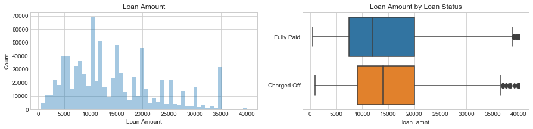


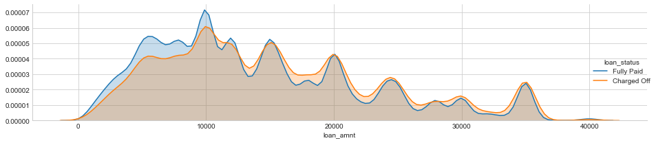


"Charged off" loans seem to have higher loan amount. I will further examine the statistical difference in the later analysis.

### term
Data Dictionary: "The number of payments on the loan. Values are in months and can be either 36 or 60."


```python
df['term'].sample(5)
```


    1442189     36 months
    1088818     36 months
    982341      36 months
    140603      60 months
    1521384     60 months
    Name: term, dtype: object


```python
df['term'].value_counts(dropna=False)
```


     36 months    618460
     60 months    196526
    Name: term, dtype: int64


```python
df['term'] = df['term'].apply(lambda s: np.int8(s.split()[0]))
```


```python
plot_var('term', 'Term', continuous=False)
```


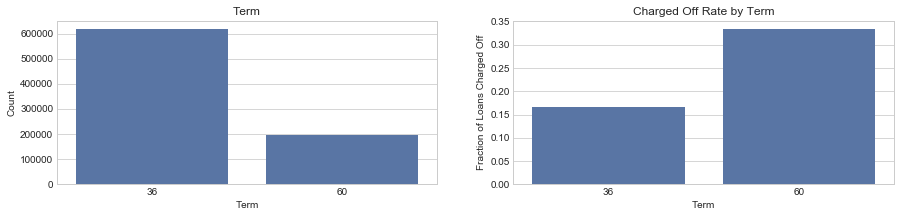


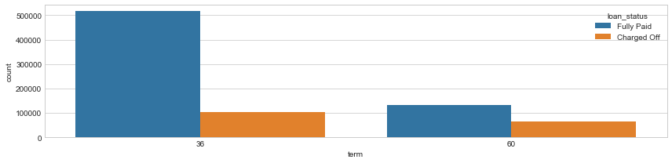


```python
df['term'].value_counts(normalize=True)
```


    36    0.75886
    60    0.24114
    Name: term, dtype: float64


About 76% of the loans are 36 months and the rest are 60 months. The latter tends to have lower fraction of being fully paid.

Compare the charge-off rate by loan period


```python
df.groupby('term')['loan_status'].value_counts(normalize=True).loc[:,'Charged Off']
```


    term
    36    0.165710
    60    0.333793
    Name: loan_status, dtype: float64


17% of the 36-month loans are charge off, while 33% of the 60-month are charged off. Longer term leads to higher charged off? This feature should be useful in modeling.

### int_rate
Data Dictionary: "Interest Rate on the loan."


```python
df['int_rate'].describe()
```


    count    814986.000000
    mean         13.490993
    std           4.618486
    min           5.320000
    25%           9.990000
    50%          13.110000
    75%          16.290000
    max          30.990000
    Name: int_rate, dtype: float64


The interest rage ranges from 5% to 31%, with a median at 13%. 


```python
plot_var('int_rate', 'Interest Rate', continuous=True)
```


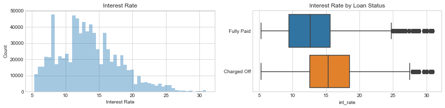


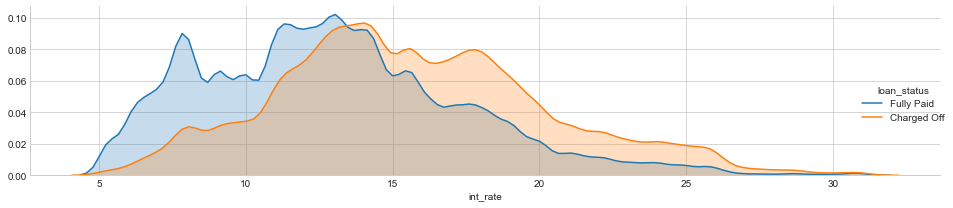


The higher the interest rate is, the more likely for being charged off. 
There are some outliers in the Fully Paid dataset. Let's take a look at them, as outliers may distort ML analysis. 

### Outliers
- outliers can be exactly what we want to learn about, e.g., anomaly detection. 
- In this project, however, outliers may distort the picture of the data in both statistical analysis and visualization. 
- Below, I use the modified Z-score method and the IQR method. Note that the variable must be continuous, not categorical, for any of these functions to make sense.

drop_list = df.select_dtypes(exclude=['object']).columns


```python
def outliers_modified_z_score(dataframe, n, features):
    """
    Takes a dataframe df of features and returns a list of the indices corresponding to the observations containing more than n outliers according to the modified z-score Method
    """
    threshold = 3.5
    outlier_indices = []
    for col in features:
        median_y = np.median(dataframe[col])
        median_absolute_deviation_y = np.median([np.abs(y - median_y) for y in dataframe[col]])
        modified_z_scores = [0.6745 * (y - median_y) / median_absolute_deviation_y for y in dataframe[col]]
        outlier_list_col = dataframe[np.abs(modified_z_scores) > threshold].index
       # append the found outlier indices for col to the list of outlier indices 
        outlier_indices.extend(outlier_list_col)
        # select observations containing more than 2 outliers
    outlier_indices = Counter(outlier_indices)        
    multiple_outliers = list( k for k, v in outlier_indices.items() if v > n )
    return multiple_outliers

#Outliers_to_drop_z_score = outliers_modified_z_score(df,2,['loan_amnt', 'term', 'int_rate', 'installment', 'annual_inc', 'dti','fico_range_high', 'pub_rec', 'mo_sin_old_il_acct', 'mo_sin_old_rev_tl_op', 'mort_acc','earliest_cr_line_'])
```


```python
def outliers_iqr(dataframe, n, features):
    """
    Takes a dataframe df of features and returns a list of the indices
    corresponding to the observations containing more than n outliers according
    to the Tukey method.
    """
    outlier_indices = []
    for col in features:
        # 1st quartile (25%) & # 3rd quartile (75%)
        quartile_1, quartile_3 = np.percentile(dataframe[col], [25,75])
        #quartile_3 = np.percentile(dataframe[col], 75)
      
        iqr = quartile_3 - quartile_1
        lower_bound = quartile_1 - (iqr * 1.5)
        upper_bound = quartile_3 + (iqr * 1.5)
        # Determine a list of indices of outliers for feature col
        outlier_list_col = dataframe[(dataframe[col] < lower_bound) | (dataframe[col] > upper_bound)].index
       # append the found outlier indices for col to the list of outlier indices 
        outlier_indices.extend(outlier_list_col)
        # select observations containing more than 2 outliers
    outlier_indices = Counter(outlier_indices)        
    multiple_outliers = list( k for k, v in outlier_indices.items() if v > n )
    return multiple_outliers
```


```python
""" 
# As our final exploratory plot, we will create pairs plot to visualize relationships between multiple pairs of variables as well as distributions of single variables.

# Extract the columns to  plot
plot_data = df[float_list]

# Replace the inf with nan
#plot_data = plot_data.replace({np.inf: np.nan, -np.inf: np.nan})

# Rename columns 
#plot_data = plot_data.rename(columns = {'Site EUI (kBtu/ft²)': 'Site EUI', 'Weather Normalized Source EUI (kBtu/ft²)': 'Weather Norm EUI', 'log_Total GHG Emissions (Metric Tons CO2e)': 'log GHG Emissions'})

# Drop na values
plot_data = plot_data.dropna()

# Function to calculate correlation coefficient between two columns
def corr_func(x, y, **kwargs):
    r = np.corrcoef(x, y)[0][1]
    ax = plt.gca()
    ax.annotate("r = {:.2f}".format(r),
                xy=(.2, .8), xycoords=ax.transAxes,
                size = 20)
# Create the pairgrid object
#grid = sns.PairGrid(data = plot_data, size = 3)

# Upper is a scatter plot
grid.map_upper(plt.scatter, color = 'red', alpha = 0.6)

# Diagonal is a histogram
grid.map_diag(plt.hist, color = 'red', edgecolor = 'black')

# Bottom is correlation and density plot
grid.map_lower(corr_func);
grid.map_lower(sns.kdeplot, cmap = plt.cm.Reds)

# Title for entire plot
plt.suptitle('Pairs Plot of Energy Data', size = 36, y = 1.02);
"""
```


    ' \n# As our final exploratory plot, we will create pairs plot to visualize relationships between multiple pairs of variables as well as distributions of single variables.\n\n# Extract the columns to  plot\nplot_data = df[float_list]\n\n# Replace the inf with nan\n#plot_data = plot_data.replace({np.inf: np.nan, -np.inf: np.nan})\n\n# Rename columns \n#plot_data = plot_data.rename(columns = {\'Site EUI (kBtu/ft²)\': \'Site EUI\', \'Weather Normalized Source EUI (kBtu/ft²)\': \'Weather Norm EUI\', \'log_Total GHG Emissions (Metric Tons CO2e)\': \'log GHG Emissions\'})\n\n# Drop na values\nplot_data = plot_data.dropna()\n\n# Function to calculate correlation coefficient between two columns\ndef corr_func(x, y, **kwargs):\n    r = np.corrcoef(x, y)[0][1]\n    ax = plt.gca()\n    ax.annotate("r = {:.2f}".format(r),\n                xy=(.2, .8), xycoords=ax.transAxes,\n                size = 20)\n# Create the pairgrid object\n#grid = sns.PairGrid(data = plot_data, size = 3)\n\n# Upper is a scatter plot\ngrid.map_upper(plt.scatter, color = \'red\', alpha = 0.6)\n\n# Diagonal is a histogram\ngrid.map_diag(plt.hist, color = \'red\', edgecolor = \'black\')\n\n# Bottom is correlation and density plot\ngrid.map_lower(corr_func);\ngrid.map_lower(sns.kdeplot, cmap = plt.cm.Reds)\n\n# Title for entire plot\nplt.suptitle(\'Pairs Plot of Energy Data\', size = 36, y = 1.02);\n'


```python
df.groupby('loan_status')['int_rate'].describe()
```


<div>
<style scoped>
    .dataframe tbody tr th:only-of-type {
        vertical-align: middle;
    }

    .dataframe tbody tr th {
        vertical-align: top;
    }

    .dataframe thead th {
        text-align: right;
    }
</style>
<table border="1" class="dataframe">
  <thead>
    <tr style="text-align: right;">
      <th></th>
      <th>count</th>
      <th>mean</th>
      <th>std</th>
      <th>min</th>
      <th>25%</th>
      <th>50%</th>
      <th>75%</th>
      <th>max</th>
    </tr>
    <tr>
      <th>loan_status</th>
      <th></th>
      <th></th>
      <th></th>
      <th></th>
      <th></th>
      <th></th>
      <th></th>
      <th></th>
    </tr>
  </thead>
  <tbody>
    <tr>
      <th>Charged Off</th>
      <td>168084.0</td>
      <td>15.736335</td>
      <td>4.625755</td>
      <td>5.32</td>
      <td>12.59</td>
      <td>15.31</td>
      <td>18.55</td>
      <td>30.99</td>
    </tr>
    <tr>
      <th>Fully Paid</th>
      <td>646902.0</td>
      <td>12.907587</td>
      <td>4.434262</td>
      <td>5.32</td>
      <td>9.49</td>
      <td>12.68</td>
      <td>15.61</td>
      <td>30.99</td>
    </tr>
  </tbody>
</table>
</div>


Any values > 75% percentile (18.5 for "charged off", 15.61 for "Fully Paid") are defined as outliers. 


```python
#df.groupby('loan_status')['int_rate'].value_counts()['Fully Paid'].sort_index()
```


```python
df.loc[(df.int_rate > 15.61) & (df.loan_status == 'Fully Paid')].shape[0]
```


    150885


```python
(df.loc[(df.int_rate > 15.61) & (df.loan_status == 'Fully Paid')].shape[0])/df['loan_status'].value_counts(normalize=False, dropna=False)[0]
```


    0.2332424385764768


```python
df.loc[(df.int_rate >18.55) & (df.loan_status == 'Charged Off')].shape[0]/df['loan_status'].value_counts(normalize=False, dropna=False)[1]
```


    0.24427072178196615


The percentage of outliers is roughly the same for the Fully Paid/Charged off data, ~23%. A bit too much to be dropped. I will keep these outliers for now.

### installment
Data Dictionary: "The monthly payment owed by the borrower if the loan originates."


```python
df['installment'].describe()
```


    count    814986.000000
    mean        436.749624
    std         255.732093
    min           4.930000
    25%         251.400000
    50%         377.040000
    75%         576.290000
    max        1714.540000
    Name: installment, dtype: float64


Installments range from \$5  to \$1715, with a median at \$377. 


```python
plot_var('installment', 'Installment', continuous=True)
```


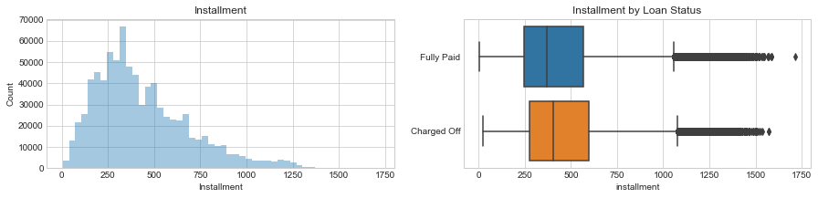


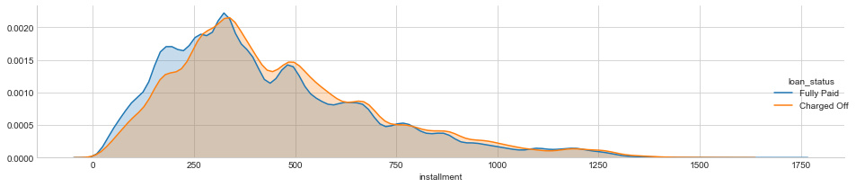


Charged-off loans tend to have higher installments but the difference of the mean values is very small (460 vs 431). Later, I will do a KS test to see if there are any statistical difference of "installment" between Fully Paid/charged off. 


```python
df.groupby('loan_status')['installment'].describe()
```


<div>
<style scoped>
    .dataframe tbody tr th:only-of-type {
        vertical-align: middle;
    }

    .dataframe tbody tr th {
        vertical-align: top;
    }

    .dataframe thead th {
        text-align: right;
    }
</style>
<table border="1" class="dataframe">
  <thead>
    <tr style="text-align: right;">
      <th></th>
      <th>count</th>
      <th>mean</th>
      <th>std</th>
      <th>min</th>
      <th>25%</th>
      <th>50%</th>
      <th>75%</th>
      <th>max</th>
    </tr>
    <tr>
      <th>loan_status</th>
      <th></th>
      <th></th>
      <th></th>
      <th></th>
      <th></th>
      <th></th>
      <th></th>
      <th></th>
    </tr>
  </thead>
  <tbody>
    <tr>
      <th>Charged Off</th>
      <td>168084.0</td>
      <td>459.973673</td>
      <td>255.309267</td>
      <td>21.62</td>
      <td>276.14</td>
      <td>402.39</td>
      <td>595.87</td>
      <td>1569.11</td>
    </tr>
    <tr>
      <th>Fully Paid</th>
      <td>646902.0</td>
      <td>430.715339</td>
      <td>255.496761</td>
      <td>4.93</td>
      <td>244.76</td>
      <td>370.92</td>
      <td>569.72</td>
      <td>1714.54</td>
    </tr>
  </tbody>
</table>
</div>


### grade, sub_grade
Data Dictionary for grade: "assigned loan grade."
Data Dictionary for sub_grade: "LC assigned loan subgrade."

What are the possible values of grade and sub_grade?


```python
sorted(df['grade'].unique())
```


    ['A', 'B', 'C', 'D', 'E', 'F', 'G']


```python
print(sorted(df['sub_grade'].unique()))
```

    ['A1', 'A2', 'A3', 'A4', 'A5', 'B1', 'B2', 'B3', 'B4', 'B5', 'C1', 'C2', 'C3', 'C4', 'C5', 'D1', 'D2', 'D3', 'D4', 'D5', 'E1', 'E2', 'E3', 'E4', 'E5', 'F1', 'F2', 'F3', 'F4', 'F5', 'G1', 'G2', 'G3', 'G4', 'G5']


The "grade" is included in the "sub_grade" column, so it could be dropped.


```python
plot_var('sub_grade','Subgrade',continuous=False)
```


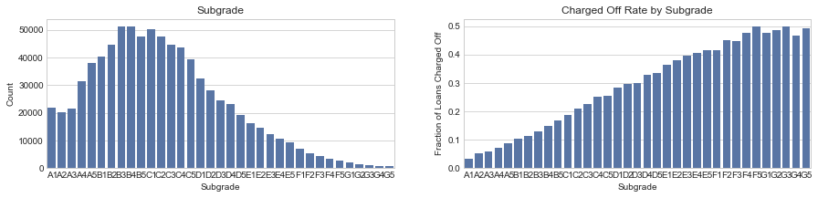


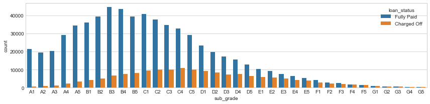


```python
plot_var('grade','Grade',continuous=False)
```


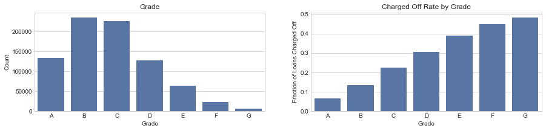


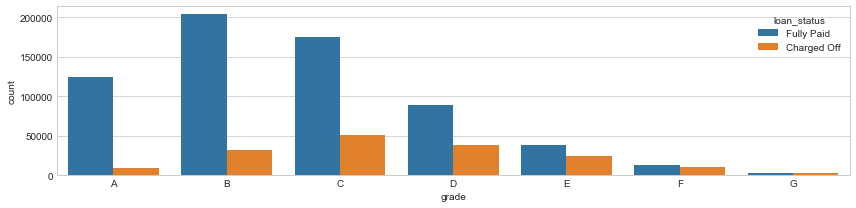


There is a trend of higher fraction of loans Charged off as the grade going from A to G, with some small variations among subgrades. 


```python
#df.drop(labels='grade',axis=1,inplace=True)
drop_cols('grade')
```

### emp_title
Data Dictionary: "The job title supplied by the Borrower when applying for the loan."


```python
df['emp_title'].describe()
```


    count      766415
    unique     280473
    top       Teacher
    freq        11351
    Name: emp_title, dtype: object


There are too many unique titles for this feature to be useful, so we drop this feature. 


```python
df['emp_title'].sample(5)
```


    984197                 Billeo
    88917                  Driver
    197593                    NaN
    1048907    RURAL MAIL CARRIER
    336144                 driver
    Name: emp_title, dtype: object


```python
drop_cols('emp_title')
```

### emp_length
Data Dictionary: "Employment length in years. Possible values are between 0 and 10 where 0 means less than one year and 10 means ten or more years." The actual data does not match this description:


```python
df['emp_length'].value_counts(dropna=False).sort_index()
```


    1 year        53411
    10+ years    264873
    2 years       73493
    3 years       64999
    4 years       48752
    5 years       52149
    6 years       40290
    7 years       39407
    8 years       38887
    9 years       31900
    < 1 year      64572
    NaN           42253
    Name: emp_length, dtype: int64


There are 42k loans without the information on emp_length. Convert this feature to integers. 


```python
df['emp_length'].replace('10+ years', '10 years', inplace=True)
```


```python
df['emp_length'].replace('< 1 year', '0 years', inplace=True)
```


```python
df['emp_length'].value_counts(dropna=False).sort_index()
```


    0 years      64572
    1 year       53411
    10 years    264873
    2 years      73493
    3 years      64999
    4 years      48752
    5 years      52149
    6 years      40290
    7 years      39407
    8 years      38887
    9 years      31900
    NaN          42253
    Name: emp_length, dtype: int64


```python
df.emp_length.map( lambda x: str(x).split()[0]).value_counts(dropna=True).sort_index()
```


    0       64572
    1       53411
    10     264873
    2       73493
    3       64999
    4       48752
    5       52149
    6       40290
    7       39407
    8       38887
    9       31900
    nan     42253
    Name: emp_length, dtype: int64


```python
df['emp_length'] = df.emp_length.map( lambda x: float(str(x).split()[0]))
```


```python
df['emp_length'].sample(5)
```


    293916    10.0
    798787     6.0
    313216    10.0
    346149    10.0
    614188     3.0
    Name: emp_length, dtype: float64


```python
plot_var('emp_length', 'Employment length', continuous=False)
```


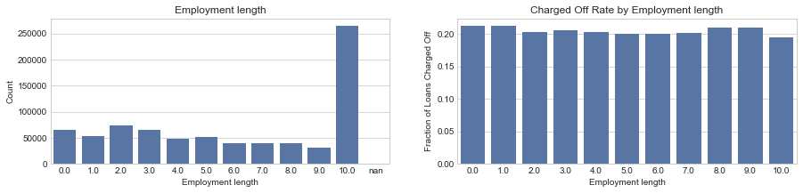


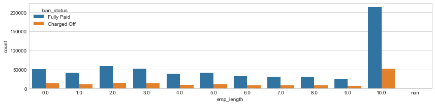


One third of the loans go to the people with longer than 10 years of employments. However, the fully paid rate seems not quite related to this feature. Again, this will be further examined in a statistical test at the end. 

### home_ownership
Data Dictionary: "The home ownership status provided by the borrower during registration or obtained from the credit report. Our values are: RENT, OWN, MORTGAGE, OTHER."


```python
df['home_ownership'].value_counts()
```


    MORTGAGE    406866
    RENT        325071
    OWN          82765
    OTHER          144
    ANY             94
    NONE            46
    Name: home_ownership, dtype: int64


Replace "ANY" & "None" with "OTHER". 


```python
df['home_ownership'].replace(['NONE','ANY'],'OTHER', inplace=True)
```


```python
df['home_ownership'].value_counts()
```


    MORTGAGE    406866
    RENT        325071
    OWN          82765
    OTHER          284
    Name: home_ownership, dtype: int64


```python
plot_var('home_ownership', 'Home Ownership', continuous=False)
```


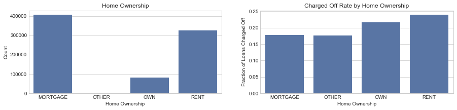


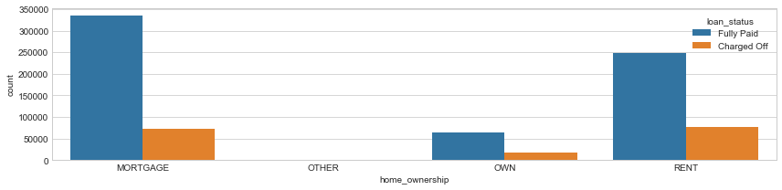


```python
df.groupby('home_ownership')['loan_status'].value_counts(normalize=True).loc[:,'Charged Off']
```


    home_ownership
    MORTGAGE    0.177808
    OTHER       0.176056
    OWN         0.215804
    RENT        0.239422
    Name: loan_status, dtype: float64


There appear to be small differences in charge-off rates by home ownership status. Mortgage & OTHER has slightly less probability of Charged-Off. Because of the large numbers of observations in each category, these differences might be statistically significant.

### annual_inc
Data Dictionary: "The self-reported annual income provided by the borrower during registration."


```python
df['annual_inc'].describe()
```


    count    8.149860e+05
    mean     7.523039e+04
    std      6.524373e+04
    min      0.000000e+00
    25%      4.500000e+04
    50%      6.500000e+04
    75%      9.000000e+04
    max      9.550000e+06
    Name: annual_inc, dtype: float64


Annual income ranges from \$0 to \$8M, with a median at \$65k, which doubles the national median individual income in the US (\$40k for males and \$25k for females). Due to the large range of variation, we log-transform the values.


```python
df['annual_inc'] = df['annual_inc'].apply(lambda x:np.log10(x+1))
```


```python
df['annual_inc'].describe()
```


    count    814986.000000
    mean          4.810836
    std           0.231893
    min           0.000000
    25%           4.653222
    50%           4.812920
    75%           4.954247
    max           6.980003
    Name: annual_inc, dtype: float64


```python
plot_var('annual_inc', 'Log10 Annual income', continuous=True)
```


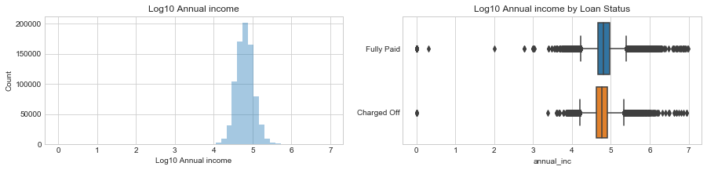


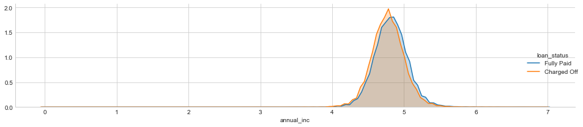


Let's look closer of the difference here


```python
df.groupby('loan_status')['annual_inc'].describe()
```


<div>
<style scoped>
    .dataframe tbody tr th:only-of-type {
        vertical-align: middle;
    }

    .dataframe tbody tr th {
        vertical-align: top;
    }

    .dataframe thead th {
        text-align: right;
    }
</style>
<table border="1" class="dataframe">
  <thead>
    <tr style="text-align: right;">
      <th></th>
      <th>count</th>
      <th>mean</th>
      <th>std</th>
      <th>min</th>
      <th>25%</th>
      <th>50%</th>
      <th>75%</th>
      <th>max</th>
    </tr>
    <tr>
      <th>loan_status</th>
      <th></th>
      <th></th>
      <th></th>
      <th></th>
      <th></th>
      <th></th>
      <th></th>
      <th></th>
    </tr>
  </thead>
  <tbody>
    <tr>
      <th>Charged Off</th>
      <td>168084.0</td>
      <td>4.777072</td>
      <td>0.227015</td>
      <td>0.0</td>
      <td>4.632467</td>
      <td>4.778158</td>
      <td>4.915096</td>
      <td>6.949393</td>
    </tr>
    <tr>
      <th>Fully Paid</th>
      <td>646902.0</td>
      <td>4.819608</td>
      <td>0.232342</td>
      <td>0.0</td>
      <td>4.672107</td>
      <td>4.812920</td>
      <td>4.963793</td>
      <td>6.980003</td>
    </tr>
  </tbody>
</table>
</div>


For both cases, there are quite a few outliers (in the lower end). 

### verication_status
Data Dictionary: "Indicates if income was verified by [Lending Club], not verified, or if the income source was verified."


```python
df['verification_status'].value_counts()
```


    Source Verified    293897
    Verified           269895
    Not Verified       251194
    Name: verification_status, dtype: int64


```python
plot_var('verification_status', 'Verification Status', continuous=False)
```


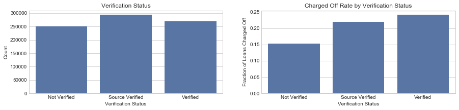


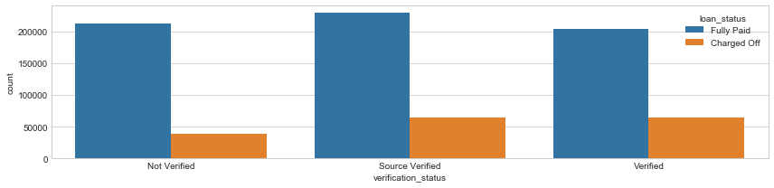


Surprisingly, verified loans have higher chance of being charged-Off. I would guess the opposite way.

### purpose
Data Dictionary: "A category provided by the borrower for the loan request."


```python
df['purpose'].value_counts()
```


    debt_consolidation    481652
    credit_card           175123
    home_improvement       50793
    other                  43900
    major_purchase         17463
    small_business         10214
    car                     8936
    medical                 8772
    moving                  5725
    vacation                5116
    house                   4095
    wedding                 2272
    renewable_energy         599
    educational              326
    Name: purpose, dtype: int64


Now let's check the charged-off rates of purposes.


```python
df.groupby('purpose')['loan_status'].value_counts(normalize=True)[:,'Charged Off'].sort_values(ascending=False)
```


    purpose
    small_business        0.302428
    renewable_energy      0.247078
    moving                0.242969
    medical               0.229366
    debt_consolidation    0.217398
    other                 0.216970
    house                 0.214652
    vacation              0.198788
    major_purchase        0.183245
    home_improvement      0.181383
    credit_card           0.178412
    educational           0.171779
    car                   0.148053
    wedding               0.121919
    Name: loan_status, dtype: float64


We see that, 30% of the loans for small_business are charged off, but only 12% of wedding are charged Off.

### title
Data Dictionary: "The loan title provided by the borrower."


```python
df['title'].describe()
```


    count                 807068
    unique                 60298
    top       Debt consolidation
    freq                  371874
    Name: title, dtype: object


```python
df['title'].value_counts().head(10)
```


    Debt consolidation         371874
    Credit card refinancing    133334
    Home improvement            39171
    Other                       33265
    Debt Consolidation          15059
    Major purchase              12311
    Medical expenses             6908
    Business                     6666
    Car financing                5667
    Consolidation                5090
    Name: title, dtype: int64


There are 12 unique purposes in the dataset, and from the top 10 titles, it seems that this information is covered in the "purpose". So we drop this column. 


```python
drop_cols('title')
```

### zip_code, addr_stat
Data Dictionary for zip_code: "The first 3 numbers of the zip code provided by the borrower in the loan application."  
Data Dictionary for addr_state: "The state provided by the borrower in the loan application."  


```python
df['zip_code'].describe()
```


    count     814986
    unique       925
    top        945xx
    freq        9517
    Name: zip_code, dtype: object


```python
df['addr_state'].describe()
```


    count     814986
    unique        51
    top           CA
    freq      124204
    Name: addr_state, dtype: object


There are many unique "zip_code" values, and the zip_code info should be equivalent to "addr_stat". Therefore we drop the "zip_code". 


```python
drop_cols('zip_code')
```


```python
df.groupby('addr_state')['loan_status'].value_counts(normalize=True)[:,'Charged Off'].sort_values(ascending=False)
```


    addr_state
    MS    0.275619
    NE    0.267946
    OK    0.248252
    AL    0.247650
    AR    0.243154
    LA    0.237900
    ND    0.237232
    NV    0.234202
    TN    0.230479
    IN    0.228179
    NY    0.227045
    SD    0.225787
    NM    0.225694
    OH    0.225400
    FL    0.222007
    MO    0.219400
    KY    0.216353
    NJ    0.216208
    NC    0.215282
    MD    0.214845
    PA    0.214776
    MN    0.210363
    MI    0.208880
    VA    0.207942
    DE    0.206575
    HI    0.204535
    AK    0.204141
    TX    0.202286
    AZ    0.199321
    CA    0.198303
    RI    0.194009
    ID    0.193487
    IL    0.193302
    MA    0.192974
    GA    0.191224
    CT    0.183810
    WV    0.182457
    UT    0.179049
    WY    0.178142
    MT    0.177759
    WI    0.175315
    SC    0.172705
    KS    0.171004
    WA    0.166538
    CO    0.158083
    OR    0.152827
    VT    0.149225
    IA    0.142857
    NH    0.142554
    ME    0.136564
    DC    0.130378
    Name: loan_status, dtype: float64


MS has the highest fraction of Charged Off (0.28), whereas DC has the lowest fraction at 0.13. 

### dti
Data Dictionary: "A ratio calculated using the borrower’s total monthly debt payments on the total debt obligations, excluding mortgage and the requested LC loan, divided by the borrower’s self-reported monthly income."


```python
df['dti'].describe()
```


    count    814950.000000
    mean         17.867719
    std           8.856477
    min          -1.000000
    25%          11.640000
    50%          17.360000
    75%          23.630000
    max         999.000000
    Name: dti, dtype: float64


The values of -1 or 999 are probably outliers. Let's look at its histogram .


```python
f, (ax1, ax2) = plt.subplots(nrows=1, ncols=2, figsize=(12,3), dpi=90)
sns.distplot(df.loc[df['dti'].notnull() & (df['dti'] < 60), 'dti'], kde=False, ax=ax1)
ax1.set_xlabel('dti')
ax1.set_ylabel('Count')
ax1.set_title('debt to income')
sns.boxplot(x=df.loc[df['dti'].notnull() & (df['dti'] < 60), 'dti'], y='loan_status', data=df, ax=ax2)
ax2.set_xlabel('DTI')
ax2.set_ylabel('Fraction of Loans fully paid')
ax2.set_title('Fully paid rate by debt to income')
ax2.set_title('DTI by loan status')
```


    Text(0.5,1,'DTI by loan status')


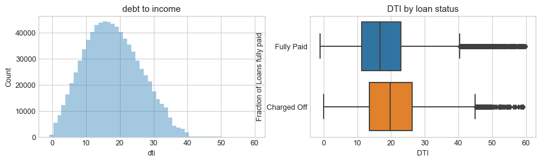


```python
(df['dti'] > 40).sum() / (df['dti']).sum()
```


    0.0001017766442811112


```python
(df['dti'] > 40).sum()
```


    1482


Very few (0.01%) outliers with dti > 60. 
From the figure it seems that the Charged Off loans have higher DTI. Let's check. 


```python
df.groupby('loan_status')['dti'].median()
```


    loan_status
    Charged Off    19.77
    Fully Paid     16.77
    Name: dti, dtype: float64


It's clear that borrowers who have higher DTI are more likely to be charged off 

### earliest_cr_line
Data Dictionary: "The month the borrower's earliest reported credit line was opened."

Rather than converting it to a date, I will use a scalar to describe the length of time since the first line of credit. If all other variables are held equal, the longer you have had lines of credit the better. 


```python
df['earliest_cr_line'].sample(5)
```


    194774     Feb-1999
    859839     Feb-2007
    42415      Sep-1999
    1487059    Dec-1993
    250915     Feb-2006
    Name: earliest_cr_line, dtype: object


```python
df['earliest_cr_line'].describe()
```


    count       814986
    unique         712
    top       Aug-2001
    freq          6024
    Name: earliest_cr_line, dtype: object


```python
df['earliest_cr_line'].isnull().any()
```


    False


```python
from datetime import datetime

df.earliest_cr_line = pd.to_datetime(df.earliest_cr_line)

dttoday = datetime.now().strftime('%Y-%m-%d')
df.earliest_cr_line = df.earliest_cr_line.apply(lambda x:(np.timedelta64((x - pd.Timestamp(dttoday)),'D').astype(int))/-365)

df.earliest_cr_line.shape
```


    (814986,)


```python
df.earliest_cr_line.sample(5)
```


    834954     23.783562
    1062327    10.775342
    958945     12.690411
    256108     34.791781
    437955     25.783562
    Name: earliest_cr_line, dtype: float64


```python
plot_var('earliest_cr_line', 'Length of of the earliest Credit Line (Months to today)', continuous=True)
```


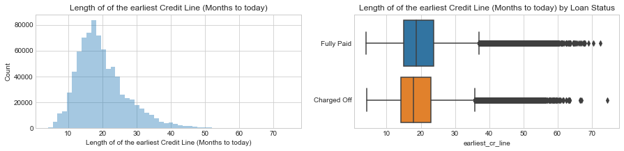


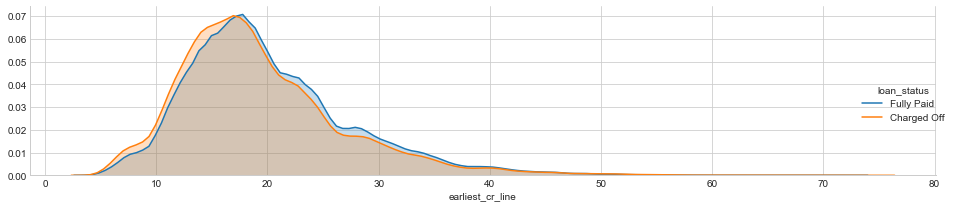


Borrowers who charged off have opened their first credit line more recently, although their medians are almost the same.


```python
df.groupby('loan_status')['earliest_cr_line'].describe()
```


<div>
<style scoped>
    .dataframe tbody tr th:only-of-type {
        vertical-align: middle;
    }

    .dataframe tbody tr th {
        vertical-align: top;
    }

    .dataframe thead th {
        text-align: right;
    }
</style>
<table border="1" class="dataframe">
  <thead>
    <tr style="text-align: right;">
      <th></th>
      <th>count</th>
      <th>mean</th>
      <th>std</th>
      <th>min</th>
      <th>25%</th>
      <th>50%</th>
      <th>75%</th>
      <th>max</th>
    </tr>
    <tr>
      <th>loan_status</th>
      <th></th>
      <th></th>
      <th></th>
      <th></th>
      <th></th>
      <th></th>
      <th></th>
      <th></th>
    </tr>
  </thead>
  <tbody>
    <tr>
      <th>Charged Off</th>
      <td>168084.0</td>
      <td>19.266402</td>
      <td>7.399904</td>
      <td>4.189041</td>
      <td>14.194521</td>
      <td>17.860274</td>
      <td>22.865753</td>
      <td>74.567123</td>
    </tr>
    <tr>
      <th>Fully Paid</th>
      <td>646902.0</td>
      <td>20.039715</td>
      <td>7.382157</td>
      <td>4.021918</td>
      <td>14.945205</td>
      <td>18.695890</td>
      <td>23.783562</td>
      <td>72.564384</td>
    </tr>
  </tbody>
</table>
</div>


### fico_range_low, fico_range_high
Data Dictionary for fico_range_low: "The lower boundary range the borrower’s FICO at loan origination belongs to."  
Data Dictionary for fico_range_high: "The upper boundary range the borrower’s FICO at loan origination belongs to."


```python
df[['fico_range_low','fico_range_high']].describe()
```


<div>
<style scoped>
    .dataframe tbody tr th:only-of-type {
        vertical-align: middle;
    }

    .dataframe tbody tr th {
        vertical-align: top;
    }

    .dataframe thead th {
        text-align: right;
    }
</style>
<table border="1" class="dataframe">
  <thead>
    <tr style="text-align: right;">
      <th></th>
      <th>fico_range_low</th>
      <th>fico_range_high</th>
    </tr>
  </thead>
  <tbody>
    <tr>
      <th>count</th>
      <td>814986.000000</td>
      <td>814986.000000</td>
    </tr>
    <tr>
      <th>mean</th>
      <td>695.603151</td>
      <td>699.603264</td>
    </tr>
    <tr>
      <th>std</th>
      <td>31.352251</td>
      <td>31.352791</td>
    </tr>
    <tr>
      <th>min</th>
      <td>625.000000</td>
      <td>629.000000</td>
    </tr>
    <tr>
      <th>25%</th>
      <td>670.000000</td>
      <td>674.000000</td>
    </tr>
    <tr>
      <th>50%</th>
      <td>690.000000</td>
      <td>694.000000</td>
    </tr>
    <tr>
      <th>75%</th>
      <td>710.000000</td>
      <td>714.000000</td>
    </tr>
    <tr>
      <th>max</th>
      <td>845.000000</td>
      <td>850.000000</td>
    </tr>
  </tbody>
</table>
</div>


Check the correlation between the two:


```python
df[['fico_range_low','fico_range_high']].corr()
```


<div>
<style scoped>
    .dataframe tbody tr th:only-of-type {
        vertical-align: middle;
    }

    .dataframe tbody tr th {
        vertical-align: top;
    }

    .dataframe thead th {
        text-align: right;
    }
</style>
<table border="1" class="dataframe">
  <thead>
    <tr style="text-align: right;">
      <th></th>
      <th>fico_range_low</th>
      <th>fico_range_high</th>
    </tr>
  </thead>
  <tbody>
    <tr>
      <th>fico_range_low</th>
      <td>1.0</td>
      <td>1.0</td>
    </tr>
    <tr>
      <th>fico_range_high</th>
      <td>1.0</td>
      <td>1.0</td>
    </tr>
  </tbody>
</table>
</div>


These two are highly correlated, therefore we only need to keep one. We create a new feature, "fico_score" which is the mean value of the "fico_range_low" and "fico_range_high"


```python
df['fico_score'] = (df['fico_range_low'] + df['fico_range_high'])/2.
```


```python
#df.drop(['fico_range_high', 'fico_range_low'], axis=1, inplace=True)
drop_cols(['fico_range_high','fico_range_low'])
```


```python
plot_var('fico_score', 'FICO Score', continuous=True)
```


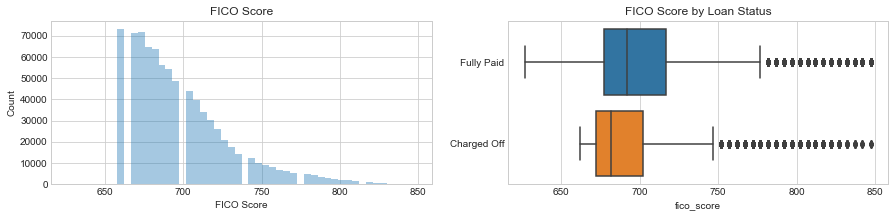


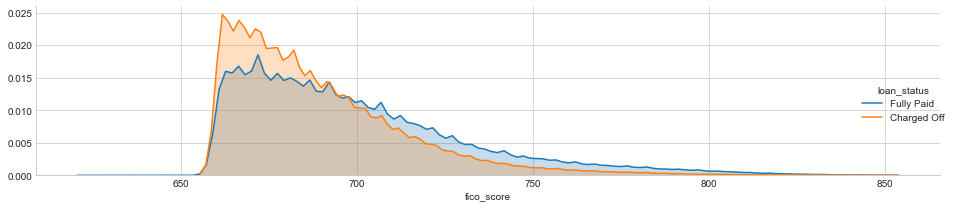


There is noticeable difference in FICO scores between fully paid and charged-off loans.

A side note, what are the missing values in the specific FICO scores (i.e., ~620, 700, 730)??

As I know that FICO score is a very important feature, I would like to check the correlations between FICO score, int_rate and the term, 3 of the most important features that are difference between "Charged-off" and "fully paid" loans from previous EDA.


```python
df[['fico_score','int_rate','term']].corr()
```


<div>
<style scoped>
    .dataframe tbody tr th:only-of-type {
        vertical-align: middle;
    }

    .dataframe tbody tr th {
        vertical-align: top;
    }

    .dataframe thead th {
        text-align: right;
    }
</style>
<table border="1" class="dataframe">
  <thead>
    <tr style="text-align: right;">
      <th></th>
      <th>fico_score</th>
      <th>int_rate</th>
      <th>term</th>
    </tr>
  </thead>
  <tbody>
    <tr>
      <th>fico_score</th>
      <td>1.000000</td>
      <td>-0.425425</td>
      <td>-0.005257</td>
    </tr>
    <tr>
      <th>int_rate</th>
      <td>-0.425425</td>
      <td>1.000000</td>
      <td>0.426839</td>
    </tr>
    <tr>
      <th>term</th>
      <td>-0.005257</td>
      <td>0.426839</td>
      <td>1.000000</td>
    </tr>
  </tbody>
</table>
</div>


It seems that the higher the fico_score is, the lower the int_rate. Let's take a look at their correlations.


```python
plot_df = df.query('fico_score > 650 & int_rate <28')[:3000]

sns.set(font_scale=1.2, rc={"lines.linewidth": 1.5}) 

g = sns.lmplot("int_rate", "fico_score", x_jitter= .7,  y_jitter= .1, data=plot_df, hue='term',lowess=True, size=5,aspect=1.4, legend_out=False, scatter_kws={ 's':20, 'alpha':.6})

g.set(xlim=(2.5, 28),ylim=(630, 880),alpha = .5)

#g.savefig('1.png',transparent=True)
```


    <seaborn.axisgrid.FacetGrid at 0x1a1f783b00>


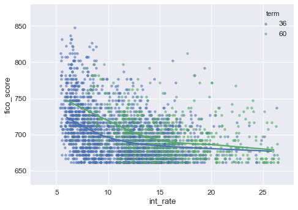


short-term loans have higher "fico_score" especially at lower "int_rate". I will explore the correlations between variables in the later analysis.

### open_acc
Data Dictionary: "The number of open credit lines in the borrower's credit file."


```python
df['open_acc'].describe()
```


    count    814986.000000
    mean         11.521099
    std           5.325064
    min           0.000000
    25%           8.000000
    50%          11.000000
    75%          14.000000
    max          90.000000
    Name: open_acc, dtype: float64


```python
#plt.figure(figsize=(10,3), dpi=90)
#sns.countplot(df['open_acc'], order=sorted(df['open_acc'].unique()),saturation=1)
#_, _ = plt.xticks(np.arange(0, 90, 5), np.arange(0, 90, 5))
#plt.title('Number of Open Credit Lines')
```


```python
plot_var('open_acc', 'Number of Open Credit Lines', continuous=True)
```


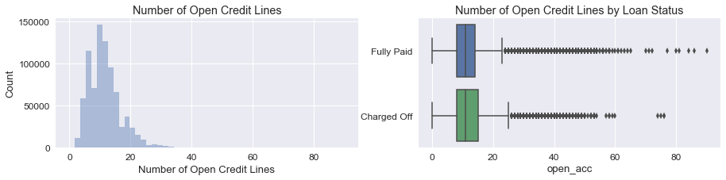


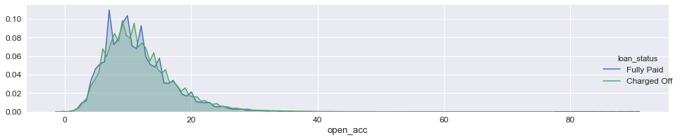


There seems no significant difference in number of credit lines between fully paid loans and charged-off loans.


```python
df.groupby('loan_status')['open_acc'].describe()
```


<div>
<style scoped>
    .dataframe tbody tr th:only-of-type {
        vertical-align: middle;
    }

    .dataframe tbody tr th {
        vertical-align: top;
    }

    .dataframe thead th {
        text-align: right;
    }
</style>
<table border="1" class="dataframe">
  <thead>
    <tr style="text-align: right;">
      <th></th>
      <th>count</th>
      <th>mean</th>
      <th>std</th>
      <th>min</th>
      <th>25%</th>
      <th>50%</th>
      <th>75%</th>
      <th>max</th>
    </tr>
    <tr>
      <th>loan_status</th>
      <th></th>
      <th></th>
      <th></th>
      <th></th>
      <th></th>
      <th></th>
      <th></th>
      <th></th>
    </tr>
  </thead>
  <tbody>
    <tr>
      <th>Charged Off</th>
      <td>168084.0</td>
      <td>11.883094</td>
      <td>5.515590</td>
      <td>0.0</td>
      <td>8.0</td>
      <td>11.0</td>
      <td>15.0</td>
      <td>76.0</td>
    </tr>
    <tr>
      <th>Fully Paid</th>
      <td>646902.0</td>
      <td>11.427041</td>
      <td>5.270369</td>
      <td>0.0</td>
      <td>8.0</td>
      <td>11.0</td>
      <td>14.0</td>
      <td>90.0</td>
    </tr>
  </tbody>
</table>
</div>


### pub_rec
Data Dictionary: "Number of derogatory public records."


```python
df['pub_rec'].describe()
```


    count    814986.000000
    mean          0.205734
    std           0.584933
    min           0.000000
    25%           0.000000
    50%           0.000000
    75%           0.000000
    max          86.000000
    Name: pub_rec, dtype: float64


```python
df['pub_rec'].value_counts().sort_values(ascending=False)
```


    0.0     681509
    1.0     112483
    2.0      14115
    3.0       4107
    4.0       1400
    5.0        651
    6.0        338
    7.0        146
    8.0         90
    9.0         42
    10.0        28
    11.0        24
    12.0        15
    13.0        11
    15.0         5
    18.0         3
    16.0         2
    19.0         2
    14.0         2
    49.0         2
    28.0         2
    86.0         1
    34.0         1
    24.0         1
    46.0         1
    54.0         1
    63.0         1
    17.0         1
    21.0         1
    40.0         1
    Name: pub_rec, dtype: int64


```python
plot_var('pub_rec','Derogatory public records', continuous=False)
```


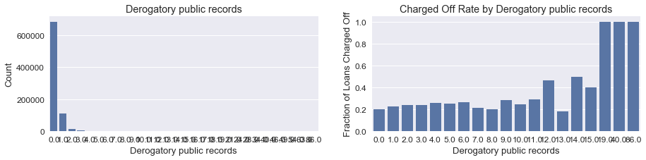


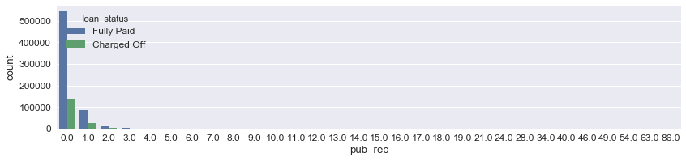


"pub_rec" > 11 have significant of Charged-Off rate. However, it's affected by low-counts. If we look at the overall statistics, the mean difference in "pub_Rec" is just 0.04 for fully paid/charged Off


```python
df.groupby('loan_status')['pub_rec'].describe()
```


<div>
<style scoped>
    .dataframe tbody tr th:only-of-type {
        vertical-align: middle;
    }

    .dataframe tbody tr th {
        vertical-align: top;
    }

    .dataframe thead th {
        text-align: right;
    }
</style>
<table border="1" class="dataframe">
  <thead>
    <tr style="text-align: right;">
      <th></th>
      <th>count</th>
      <th>mean</th>
      <th>std</th>
      <th>min</th>
      <th>25%</th>
      <th>50%</th>
      <th>75%</th>
      <th>max</th>
    </tr>
    <tr>
      <th>loan_status</th>
      <th></th>
      <th></th>
      <th></th>
      <th></th>
      <th></th>
      <th></th>
      <th></th>
      <th></th>
    </tr>
  </thead>
  <tbody>
    <tr>
      <th>Charged Off</th>
      <td>168084.0</td>
      <td>0.232247</td>
      <td>0.640855</td>
      <td>0.0</td>
      <td>0.0</td>
      <td>0.0</td>
      <td>0.0</td>
      <td>86.0</td>
    </tr>
    <tr>
      <th>Fully Paid</th>
      <td>646902.0</td>
      <td>0.198845</td>
      <td>0.569304</td>
      <td>0.0</td>
      <td>0.0</td>
      <td>0.0</td>
      <td>0.0</td>
      <td>63.0</td>
    </tr>
  </tbody>
</table>
</div>


What if we group the few bins with lower values together into 1 bin?


```python
df.pub_rec = df.pub_rec.map(lambda x: 3 if x >2.0 else x)
```


```python
df['pub_rec'].value_counts().sort_values(ascending=False)
```


    0.0    681509
    1.0    112483
    2.0     14115
    3.0      6879
    Name: pub_rec, dtype: int64


```python
plot_var('pub_rec','Derogatory public records', continuous=False)
```


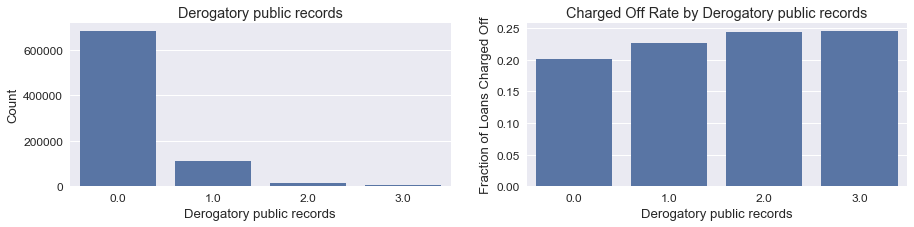


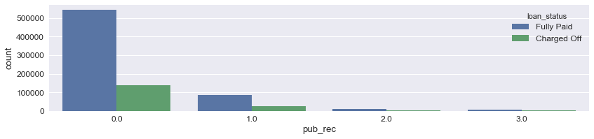


```python
df.groupby('loan_status')['pub_rec'].describe()
```


<div>
<style scoped>
    .dataframe tbody tr th:only-of-type {
        vertical-align: middle;
    }

    .dataframe tbody tr th {
        vertical-align: top;
    }

    .dataframe thead th {
        text-align: right;
    }
</style>
<table border="1" class="dataframe">
  <thead>
    <tr style="text-align: right;">
      <th></th>
      <th>count</th>
      <th>mean</th>
      <th>std</th>
      <th>min</th>
      <th>25%</th>
      <th>50%</th>
      <th>75%</th>
      <th>max</th>
    </tr>
    <tr>
      <th>loan_status</th>
      <th></th>
      <th></th>
      <th></th>
      <th></th>
      <th></th>
      <th></th>
      <th></th>
      <th></th>
    </tr>
  </thead>
  <tbody>
    <tr>
      <th>Charged Off</th>
      <td>168084.0</td>
      <td>0.222591</td>
      <td>0.523628</td>
      <td>0.0</td>
      <td>0.0</td>
      <td>0.0</td>
      <td>0.0</td>
      <td>3.0</td>
    </tr>
    <tr>
      <th>Fully Paid</th>
      <td>646902.0</td>
      <td>0.191584</td>
      <td>0.485842</td>
      <td>0.0</td>
      <td>0.0</td>
      <td>0.0</td>
      <td>0.0</td>
      <td>3.0</td>
    </tr>
  </tbody>
</table>
</div>


After grouping, it is clear that: pub_rec are mostly 0 & 1; pub_rec with 1 and higher have higher chance of being charged off than pub_rec of 0. 

### pub_rec_bankruptcies
Data Dictionary: "Number of public record bankruptcies."


```python
plot_var('pub_rec_bankruptcies', 'Number of public record bankruptcies', continuous=False)
```


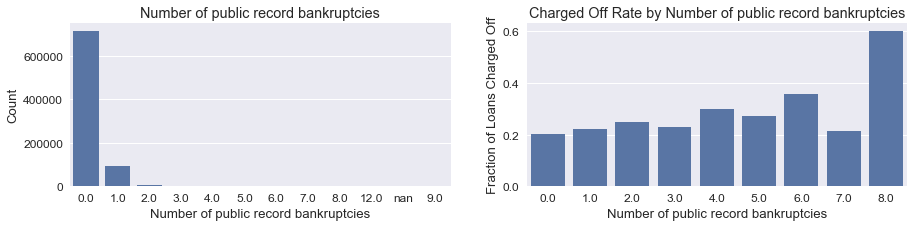


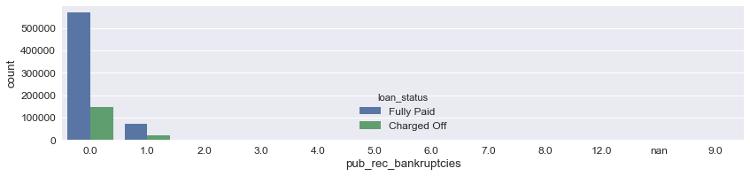


```python
df[['pub_rec','pub_rec_bankruptcies']].corr()
```


<div>
<style scoped>
    .dataframe tbody tr th:only-of-type {
        vertical-align: middle;
    }

    .dataframe tbody tr th {
        vertical-align: top;
    }

    .dataframe thead th {
        text-align: right;
    }
</style>
<table border="1" class="dataframe">
  <thead>
    <tr style="text-align: right;">
      <th></th>
      <th>pub_rec</th>
      <th>pub_rec_bankruptcies</th>
    </tr>
  </thead>
  <tbody>
    <tr>
      <th>pub_rec</th>
      <td>1.000000</td>
      <td>0.750146</td>
    </tr>
    <tr>
      <th>pub_rec_bankruptcies</th>
      <td>0.750146</td>
      <td>1.000000</td>
    </tr>
  </tbody>
</table>
</div>


"pub_rec" and "pub_rec_bankruptcies" are highly correlated. could only feed one of them into the modeling.

### revol_bal
Data Dictionary: "Total credit revolving balance."


```python
df['revol_bal'].describe()
```


    count    8.149860e+05
    mean     1.606864e+04
    std      2.160500e+04
    min      0.000000e+00
    25%      6.014000e+03
    50%      1.118500e+04
    75%      1.972300e+04
    max      2.568995e+06
    Name: revol_bal, dtype: float64


```python
df['revol_bal'] = df['revol_bal'].apply(lambda x:np.log10(x+1))
```


```python
plot_var('revol_bal', 'Log10 total credit revolving balance', continuous=True)
```


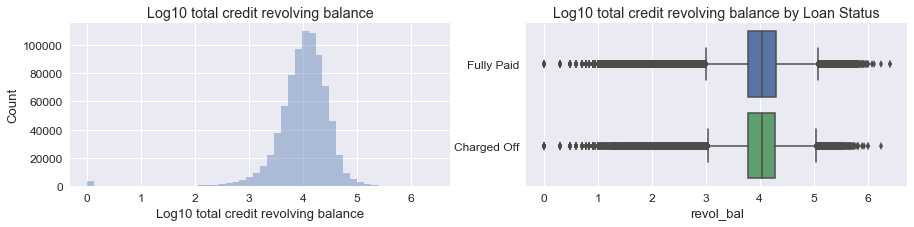


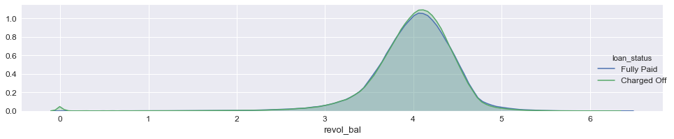


### revol_util
Data Dictionary: "Revolving line utilization rate, or the amount of credit the borrower is using relative to all available revolving credit."


```python
df['revol_util'].describe()
```


    count    814496.000000
    mean         53.031137
    std          24.320981
    min           0.000000
    25%          35.000000
    50%          53.700000
    75%          71.900000
    max         892.300000
    Name: revol_util, dtype: float64


```python
plot_var('revol_util', 'Revolving line utilization rate', continuous=True)
```


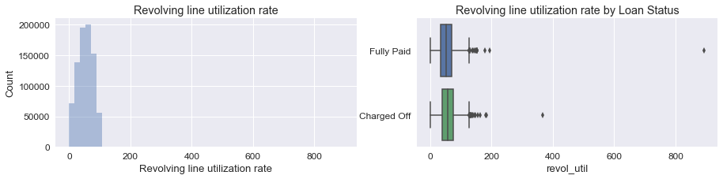


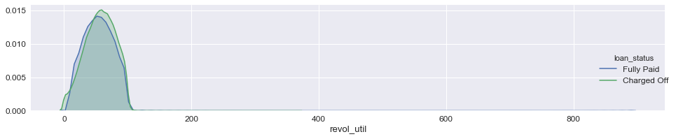


```python
df.groupby('loan_status')['revol_util'].describe()
```


<div>
<style scoped>
    .dataframe tbody tr th:only-of-type {
        vertical-align: middle;
    }

    .dataframe tbody tr th {
        vertical-align: top;
    }

    .dataframe thead th {
        text-align: right;
    }
</style>
<table border="1" class="dataframe">
  <thead>
    <tr style="text-align: right;">
      <th></th>
      <th>count</th>
      <th>mean</th>
      <th>std</th>
      <th>min</th>
      <th>25%</th>
      <th>50%</th>
      <th>75%</th>
      <th>max</th>
    </tr>
    <tr>
      <th>loan_status</th>
      <th></th>
      <th></th>
      <th></th>
      <th></th>
      <th></th>
      <th></th>
      <th></th>
      <th></th>
    </tr>
  </thead>
  <tbody>
    <tr>
      <th>Charged Off</th>
      <td>167974.0</td>
      <td>56.475417</td>
      <td>23.566253</td>
      <td>0.0</td>
      <td>39.5</td>
      <td>57.5</td>
      <td>74.7</td>
      <td>366.6</td>
    </tr>
    <tr>
      <th>Fully Paid</th>
      <td>646522.0</td>
      <td>52.136273</td>
      <td>24.433954</td>
      <td>0.0</td>
      <td>33.9</td>
      <td>52.7</td>
      <td>71.0</td>
      <td>892.3</td>
    </tr>
  </tbody>
</table>
</div>


Charged Off loans tend to have higher revol_util.

### total_acc
Data Dictionary: "The total number of credit lines currently in the borrower's credit file."


```python
df['total_acc'].describe()
```


    count    814986.000000
    mean         25.421359
    std          11.970502
    min           2.000000
    25%          17.000000
    50%          24.000000
    75%          32.000000
    max         176.000000
    Name: total_acc, dtype: float64


```python
plot_var('total_acc', 'total number of credit lines', continuous=True)
```


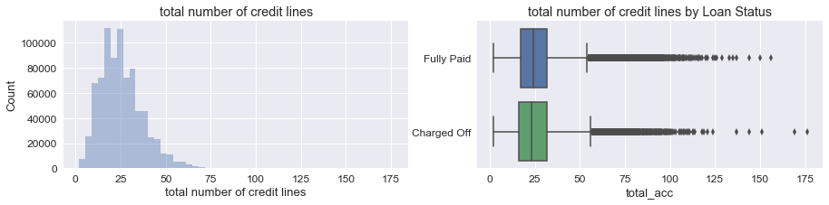


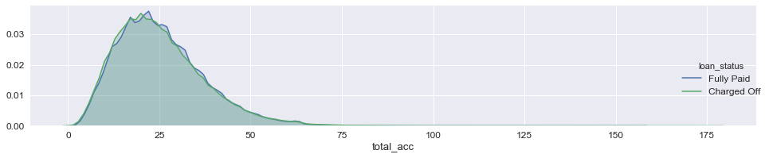


### initial_list_status
Data Dictionary: "The initial listing status of the loan. Possible values are – W, F  (whole vs. fractional)


```python
df['initial_list_status'].value_counts()
```


    f    413678
    w    401308
    Name: initial_list_status, dtype: int64


Half of the granted loans are in whole amount and half are in fractional amount. "Whole" has higher fraction of Charged-Off.


```python
plot_var('initial_list_status','Initial listing status of the loan', continuous=False)
```


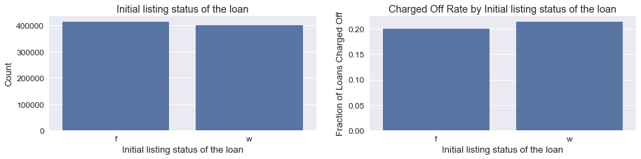


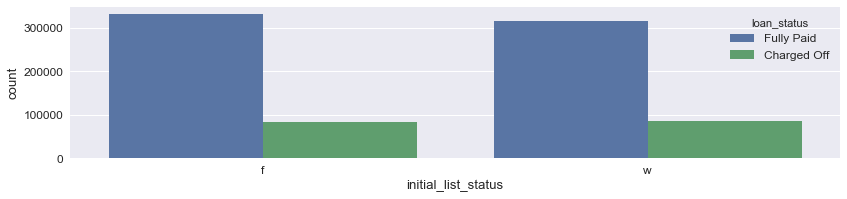


### policy_code
Data Dictionary: "publicly available policy_code=1; new products not publicly available policy_code=2"


```python
df['policy_code'].value_counts()
```


    1.0    814986
    Name: policy_code, dtype: int64


All values are the same; drop this feature. 


```python
drop_cols('policy_code')
```

### application_type
Data Dictionary: "Indicates whether the loan is an individual application or a joint application with two co-borrowers."


```python
df['application_type'].value_counts()
```


    Individual    811207
    Joint App       3779
    Name: application_type, dtype: int64


```python
plot_var('application_type', 'Application Type', continuous=False)
```


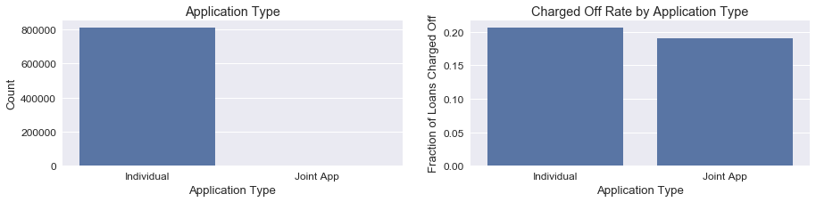


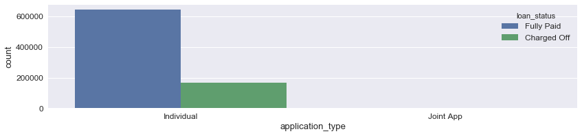


The majority of the loans are individual applications and they are more possible to be charged off than joint app.

### mo_sin_old_il_acct
Data Dictionary: "Months since oldest bank installment account opened."


```python
df['mo_sin_old_il_acct'].describe()
```


    count    725427.000000
    mean        125.926232
    std          51.554620
    min           0.000000
    25%          98.000000
    50%         129.000000
    75%         152.000000
    max         724.000000
    Name: mo_sin_old_il_acct, dtype: float64


```python
plot_var('mo_sin_old_il_acct', 'Month Since oldest installment account opened', continuous=True)
```


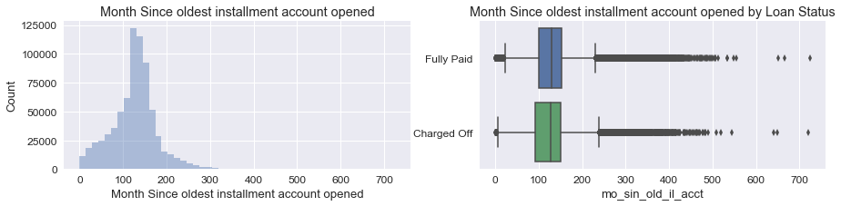


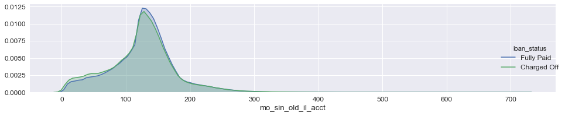


### mo_sin_old_rev_tl_op
Data Dictionary: "Months since oldest revolving account opened."


```python
df['mo_sin_old_rev_tl_op'].describe()
```


    count    747458.000000
    mean        180.843182
    std          92.192939
    min           2.000000
    25%         117.000000
    50%         164.000000
    75%         228.000000
    max         842.000000
    Name: mo_sin_old_rev_tl_op, dtype: float64


```python
plot_var('mo_sin_old_rev_tl_op', 'Months since oldest revolving account opened', continuous=True)
```


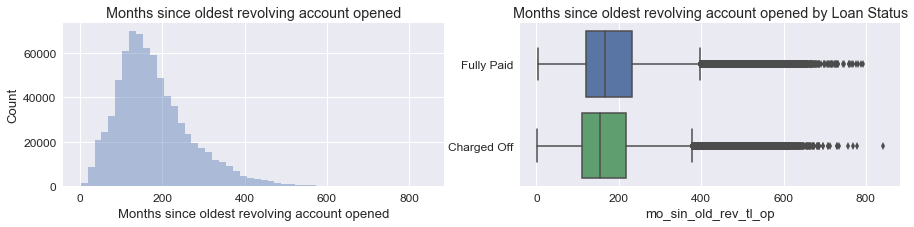


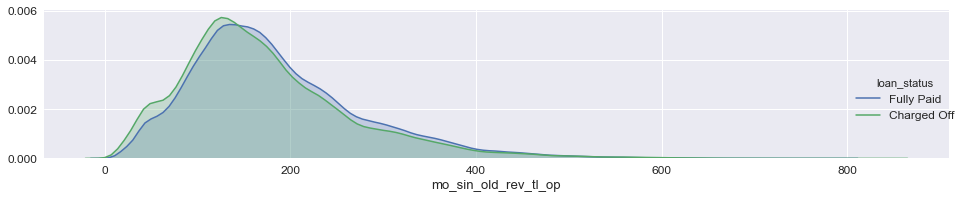


### mort_acc
Data Dictionary: "Number of mortgage accounts."


```python
df['mort_acc'].describe()
```


    count    767705.000000
    mean          1.758707
    std           2.081730
    min           0.000000
    25%           0.000000
    50%           1.000000
    75%           3.000000
    max          51.000000
    Name: mort_acc, dtype: float64


```python
plot_var('mort_acc', 'Number of mortgage accounts', continuous=False)
```


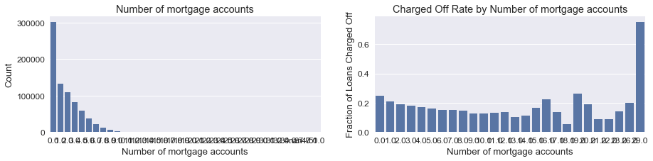


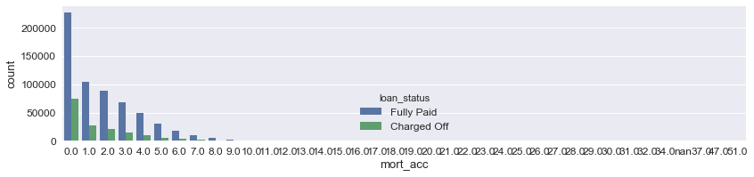


```python
df.mort_acc = df.mort_acc.map(lambda x: 6.0 if x > 6.0 else x)
```


```python
plot_var('mort_acc', 'Number of mortgage accounts', continuous=False)
```


The more the number of mortgage accounts, the lower fraction of loans charged off. 


```python
df.groupby('loan_status')['mort_acc'].describe()
```


<div>
<style scoped>
    .dataframe tbody tr th:only-of-type {
        vertical-align: middle;
    }

    .dataframe tbody tr th {
        vertical-align: top;
    }

    .dataframe thead th {
        text-align: right;
    }
</style>
<table border="1" class="dataframe">
  <thead>
    <tr style="text-align: right;">
      <th></th>
      <th>count</th>
      <th>mean</th>
      <th>std</th>
      <th>min</th>
      <th>25%</th>
      <th>50%</th>
      <th>75%</th>
      <th>max</th>
    </tr>
    <tr>
      <th>loan_status</th>
      <th></th>
      <th></th>
      <th></th>
      <th></th>
      <th></th>
      <th></th>
      <th></th>
      <th></th>
    </tr>
  </thead>
  <tbody>
    <tr>
      <th>Charged Off</th>
      <td>161198.0</td>
      <td>1.401177</td>
      <td>1.737651</td>
      <td>0.0</td>
      <td>0.0</td>
      <td>1.0</td>
      <td>2.0</td>
      <td>6.0</td>
    </tr>
    <tr>
      <th>Fully Paid</th>
      <td>606507.0</td>
      <td>1.765027</td>
      <td>1.881911</td>
      <td>0.0</td>
      <td>0.0</td>
      <td>1.0</td>
      <td>3.0</td>
      <td>6.0</td>
    </tr>
  </tbody>
</table>
</div>


## 5 (Linear) correlation between (numerical) features 
<a id="corr"></a>
I have looked at the features individually. Now I'm going to explore the correlations between the features. 

### 5.1 Convert target variable to 0/1 indicator
<a id="converttarget"></a>
It's more convenient/useful to convert our target variable to numerical variable. Fully Paid = 0, Charged Off = 1


```python
# Next, I will convert the "loan_status" column to a 0/1 "charged off" column. Fully Paid:0 Charged Off: 1
df['Charged_Off'] = df['loan_status'].apply(lambda s: np.float(s == 'Charged Off'))
drop_cols('loan_status')
```

### 5.2 K-S test
<a id="kstest"></a>

We can use K-S tests to check whether the distributions of each feature of the two classes ("Fully paid" or "charged-off") are drawn from the same distribution. If the K-S statistic is small or the p-value is high, we cannot reject the null hypothesis that the distributions of the two samples are the same, i.e., if p<0.05: different.

For variables with values of either 0 or 1, so we can use proportion Z tests to check whether the difference in mean values is statistically significant.

K-S Tests and Z Tests and chi-squared Tests
- We can use K-S tests to check whether the distributions of each feature of the two classes are drawn from the same distribution. 
- For features with only 0 or 1 values, we can use proportion Z tests to check whether the difference in mean values is statistically significant. 
- For categorical features, we can use chi-squared Tests


```python
list_float = df.select_dtypes(exclude=['object']).columns
```


```python
def run_KS_test(feature):
    dist1 = df.loc[df.Charged_Off == 0,feature]
    dist2 = df.loc[df.Charged_Off == 1,feature]
    print(feature+':')
    print(ks_2samp(dist1,dist2),'\n')
```


```python
from statsmodels.stats.proportion import proportions_ztest
def run_proportion_Z_test(feature):
    dist1 = df.loc[df.Charged_Off == 0, feature]
    dist2 = df.loc[df.Charged_Off == 1, feature]
    n1 = len(dist1)
    p1 = dist1.sum()
    n2 = len(dist2)
    p2 = dist2.sum()
    z_score, p_value = proportions_ztest([p1, p2], [n1, n2])
    print(feature+':')
    print('z-score = {}; p-value = {}'.format(z_score, p_value),'\n')
```


```python
from scipy.stats import chi2_contingency
def run_chi2_test(df, feature):

    dist1 = df.loc[df.loan_status == 'Fully Paid',feature].value_counts().sort_index().tolist()
    dist2 = df.loc[df.loan_status == 'Charged Off',feature].value_counts().sort_index().tolist()
    chi2, p, dof, expctd = chi2_contingency([dist1,dist2])
    print(feature+':')
    print("chi-square test statistic:", chi2)
    print("p-value", p, '\n')
```


```python
#ks_list = ['loan_amnt','int_rate','installment','emp_length','annual_inc','dti','earliest_cr_line','open_acc','pub_rec','mo_sin_old_il_acct','mo_sin_old_rev_tl_op','fico_score','pub_rec_bankruptcies']
```


```python
for i in list_float:
    run_KS_test(i)    
```

    loan_amnt:
    Ks_2sampResult(statistic=0.07929615091065739, pvalue=0.0) 
    
    term:
    Ks_2sampResult(statistic=0.1878843211069673, pvalue=0.0) 
    
    int_rate:
    Ks_2sampResult(statistic=0.25494110149394783, pvalue=0.0) 
    
    installment:
    Ks_2sampResult(statistic=0.06536048843842956, pvalue=0.0) 
    
    emp_length:
    Ks_2sampResult(statistic=0.023675009354882204, pvalue=2.0124344632383046e-65) 
    
    annual_inc:
    Ks_2sampResult(statistic=0.0820131215319414, pvalue=0.0) 
    
    dti:
    Ks_2sampResult(statistic=0.13172341350693528, pvalue=0.0) 
    
    earliest_cr_line:
    Ks_2sampResult(statistic=0.05313445396103783, pvalue=0.0) 
    
    open_acc:
    Ks_2sampResult(statistic=0.03457677956795924, pvalue=4.596625980394497e-139) 
    
    pub_rec:
    Ks_2sampResult(statistic=0.0230215607998836, pvalue=6.952780246869564e-62) 
    
    revol_bal:
    Ks_2sampResult(statistic=0.011420765232811325, pvalue=1.4985768186837867e-15) 
    
    revol_util:
    Ks_2sampResult(statistic=0.07482343533269276, pvalue=0.0) 
    
    total_acc:
    Ks_2sampResult(statistic=0.018250693539464735, pvalue=4.737597044498509e-39) 
    
    mo_sin_old_il_acct:
    Ks_2sampResult(statistic=0.04084630903322478, pvalue=6.727990925199112e-194) 
    
    mo_sin_old_rev_tl_op:
    Ks_2sampResult(statistic=0.06805234769510238, pvalue=0.0) 
    
    mort_acc:
    Ks_2sampResult(statistic=0.09730608428393561, pvalue=0.0) 
    
    pub_rec_bankruptcies:
    Ks_2sampResult(statistic=0.01317583643442255, pvalue=1.4782487777629064e-20) 
    
    fico_score:
    Ks_2sampResult(statistic=0.14589298735057676, pvalue=0.0) 
    
    Charged_Off:
    Ks_2sampResult(statistic=1.0, pvalue=0.0) 
    


OK, it seems that all of these features have different distributions for Fully Paid/Charged Off.

### 5.3 Pearson Correlation
<a id="pearson"></a>


```python
df.info()
```

    <class 'pandas.core.frame.DataFrame'>
    Int64Index: 814986 entries, 0 to 1646792
    Data columns (total 27 columns):
    loan_amnt               814986 non-null float64
    term                    814986 non-null int64
    int_rate                814986 non-null float64
    installment             814986 non-null float64
    sub_grade               814986 non-null object
    emp_length              772733 non-null float64
    home_ownership          814986 non-null object
    annual_inc              814986 non-null float64
    verification_status     814986 non-null object
    issue_d                 814986 non-null object
    purpose                 814986 non-null object
    addr_state              814986 non-null object
    dti                     814950 non-null float64
    earliest_cr_line        814986 non-null float64
    open_acc                814986 non-null float64
    pub_rec                 814986 non-null float64
    revol_bal               814986 non-null float64
    revol_util              814496 non-null float64
    total_acc               814986 non-null float64
    initial_list_status     814986 non-null object
    application_type        814986 non-null object
    mo_sin_old_il_acct      725427 non-null float64
    mo_sin_old_rev_tl_op    747458 non-null float64
    mort_acc                767705 non-null float64
    pub_rec_bankruptcies    814289 non-null float64
    fico_score              814986 non-null float64
    Charged_Off             814986 non-null float64
    dtypes: float64(18), int64(1), object(8)
    memory usage: 214.1+ MB


```python
list_float = df.select_dtypes(exclude=['object']).columns
```


```python
list_float
```


    Index(['loan_amnt', 'term', 'int_rate', 'installment', 'emp_length',
           'annual_inc', 'dti', 'earliest_cr_line', 'open_acc', 'pub_rec',
           'revol_bal', 'revol_util', 'total_acc', 'mo_sin_old_il_acct',
           'mo_sin_old_rev_tl_op', 'mort_acc', 'pub_rec_bankruptcies',
           'fico_score', 'Charged_Off'],
          dtype='object')


```python
fig, ax = plt.subplots(figsize=(15,12))         # Sample figsize in inches
cm_df = sns.heatmap(df[list_float].corr(),annot=True, fmt = ".2f", cmap = "coolwarm", ax=ax)
```


The linearly correlated features are: 
- "installment" vs "loan_amnt" (0.95)
- "mo_sin_old_rev_tl_op"* vs "earliest_cr_line" (0.91)
- "pub_rec_bankruptcies"* vs "pub_rec" (0.75)
- "total_acc" vs "open_acc" (0.69)   
(*) with null values

Dependence of Charged-off on the predictors: "int_rate" is the most correlated one.


```python
cor = df[list_float].corr()
cor.loc[:,:] = np.tril(cor, k=-1) # below main lower triangle of an array
cor = cor.stack()
cor[(cor > 0.1) | (cor < -0.1)]
```


    term                  loan_amnt               0.386449
    int_rate              loan_amnt               0.158214
                          term                    0.426839
    installment           loan_amnt               0.953588
                          term                    0.145842
                          int_rate                0.160821
    annual_inc            loan_amnt               0.504394
                          term                    0.122812
                          int_rate               -0.102222
                          installment             0.483259
                          emp_length              0.136435
    dti                   int_rate                0.170415
                          annual_inc             -0.215161
    earliest_cr_line      loan_amnt               0.148525
                          int_rate               -0.112131
                          installment             0.131444
                          emp_length              0.216412
                          annual_inc              0.202806
    open_acc              loan_amnt               0.193697
                          installment             0.183500
                          annual_inc              0.226926
                          dti                     0.279120
                          earliest_cr_line        0.121138
    revol_bal             loan_amnt               0.363518
                          term                    0.110520
                          installment             0.349779
                          emp_length              0.107722
                          annual_inc              0.306059
                          dti                     0.219748
                          earliest_cr_line        0.189986
                          open_acc                0.305423
                          pub_rec                -0.140176
    revol_util            loan_amnt               0.108488
                          int_rate                0.256850
                          installment             0.126761
                          dti                     0.173029
                          open_acc               -0.141107
                          revol_bal               0.462365
    total_acc             loan_amnt               0.216434
                          installment             0.194081
                          emp_length              0.108882
                          annual_inc              0.306976
                          dti                     0.211689
                          earliest_cr_line        0.272654
                          open_acc                0.689616
                          revol_bal               0.228850
                          revol_util             -0.108681
    mo_sin_old_il_acct    loan_amnt               0.125841
                          installment             0.105532
                          emp_length              0.132067
                          annual_inc              0.201579
                          earliest_cr_line        0.360532
                          open_acc                0.128233
                          revol_bal               0.111792
                          total_acc               0.337302
    mo_sin_old_rev_tl_op  loan_amnt               0.164298
                          int_rate               -0.131125
                          installment             0.145231
                          emp_length              0.211206
                          annual_inc              0.202146
                          earliest_cr_line        0.911349
                          open_acc                0.132229
                          revol_bal               0.212607
                          total_acc               0.284477
                          mo_sin_old_il_acct      0.219667
    mort_acc              loan_amnt               0.230501
                          term                    0.100799
                          installment             0.197997
                          emp_length              0.208462
                          annual_inc              0.350509
                          earliest_cr_line        0.302861
                          open_acc                0.115478
                          revol_bal               0.187637
                          total_acc               0.373703
                          mo_sin_old_il_acct      0.206741
                          mo_sin_old_rev_tl_op    0.307306
    pub_rec_bankruptcies  loan_amnt              -0.104761
                          pub_rec                 0.750146
                          revol_bal              -0.143372
    fico_score            loan_amnt               0.100319
                          int_rate               -0.425425
                          annual_inc              0.108242
                          earliest_cr_line        0.114372
                          pub_rec                -0.220529
                          revol_util             -0.454739
                          mo_sin_old_rev_tl_op    0.118714
                          mort_acc                0.103025
                          pub_rec_bankruptcies   -0.206954
    Charged_Off           term                    0.177708
                          int_rate                0.247815
                          dti                     0.123031
                          fico_score             -0.139429
    dtype: float64


```python
df[["installment","loan_amnt","mo_sin_old_rev_tl_op","earliest_cr_line","total_acc","open_acc", "pub_rec_bankruptcies", "pub_rec"]].isnull().any()
```


    installment             False
    loan_amnt               False
    mo_sin_old_rev_tl_op     True
    earliest_cr_line        False
    total_acc               False
    open_acc                False
    pub_rec_bankruptcies     True
    pub_rec                 False
    dtype: bool


```python
list_linear = ['installment', 'mo_sin_old_rev_tl_op','total_acc','pub_rec_bankruptcies']
```


```python
linear_corr = pd.DataFrame()
```


```python
# Pearson coefficients
for col in df[list_float].columns:
    linear_corr.loc[col, 'pearson_corr'] = df[col].corr(df['Charged_Off'])
linear_corr['abs_pearson_corr'] = abs(linear_corr['pearson_corr'])
```


```python
# F-statistics:
    
```

Sort the results by the absolute value of the Pearson Correlation


```python
linear_corr.sort_values('abs_pearson_corr', ascending=False, inplace=True)
linear_corr.drop('abs_pearson_corr', axis=1, inplace=True)
linear_corr.drop('Charged_Off', axis=0, inplace=True)
```


```python
linear_corr.reset_index(inplace=True)
#linear_corr.rename(columns={'index':'variable'}, inplace=True)
```


```python
linear_corr
```


<div>
<style scoped>
    .dataframe tbody tr th:only-of-type {
        vertical-align: middle;
    }

    .dataframe tbody tr th {
        vertical-align: top;
    }

    .dataframe thead th {
        text-align: right;
    }
</style>
<table border="1" class="dataframe">
  <thead>
    <tr style="text-align: right;">
      <th></th>
      <th>index</th>
      <th>pearson_corr</th>
    </tr>
  </thead>
  <tbody>
    <tr>
      <th>0</th>
      <td>int_rate</td>
      <td>0.247815</td>
    </tr>
    <tr>
      <th>1</th>
      <td>term</td>
      <td>0.177708</td>
    </tr>
    <tr>
      <th>2</th>
      <td>fico_score</td>
      <td>-0.139429</td>
    </tr>
    <tr>
      <th>3</th>
      <td>dti</td>
      <td>0.123031</td>
    </tr>
    <tr>
      <th>4</th>
      <td>mort_acc</td>
      <td>-0.079739</td>
    </tr>
    <tr>
      <th>5</th>
      <td>annual_inc</td>
      <td>-0.074216</td>
    </tr>
    <tr>
      <th>6</th>
      <td>revol_util</td>
      <td>0.072185</td>
    </tr>
    <tr>
      <th>7</th>
      <td>loan_amnt</td>
      <td>0.064139</td>
    </tr>
    <tr>
      <th>8</th>
      <td>mo_sin_old_rev_tl_op</td>
      <td>-0.048529</td>
    </tr>
    <tr>
      <th>9</th>
      <td>installment</td>
      <td>0.046291</td>
    </tr>
    <tr>
      <th>10</th>
      <td>earliest_cr_line</td>
      <td>-0.042325</td>
    </tr>
    <tr>
      <th>11</th>
      <td>open_acc</td>
      <td>0.034652</td>
    </tr>
    <tr>
      <th>12</th>
      <td>mo_sin_old_il_acct</td>
      <td>-0.026019</td>
    </tr>
    <tr>
      <th>13</th>
      <td>pub_rec</td>
      <td>0.025395</td>
    </tr>
    <tr>
      <th>14</th>
      <td>pub_rec_bankruptcies</td>
      <td>0.017314</td>
    </tr>
    <tr>
      <th>15</th>
      <td>emp_length</td>
      <td>-0.012463</td>
    </tr>
    <tr>
      <th>16</th>
      <td>total_acc</td>
      <td>-0.011187</td>
    </tr>
    <tr>
      <th>17</th>
      <td>revol_bal</td>
      <td>0.002233</td>
    </tr>
  </tbody>
</table>
</div>


The variables most linearly correlated with our target variable are interest rate, loan term, Fico Score and debt-to-income ratio. The least correlated features are the revolving balance, employment length, and public record. 


```python
# Drop the linear correlated features
drop_cols(list_linear)
```


```python
df.shape
```


    (814986, 23)


## 6. Feature Engineering
<a id="featureeng"></a>
I am going to further cleaning the data. 


```python
df.info()
```

    <class 'pandas.core.frame.DataFrame'>
    Int64Index: 814986 entries, 0 to 1646792
    Data columns (total 23 columns):
    loan_amnt              814986 non-null float64
    term                   814986 non-null int64
    int_rate               814986 non-null float64
    sub_grade              814986 non-null object
    emp_length             772733 non-null float64
    home_ownership         814986 non-null object
    annual_inc             814986 non-null float64
    verification_status    814986 non-null object
    issue_d                814986 non-null object
    purpose                814986 non-null object
    addr_state             814986 non-null object
    dti                    814950 non-null float64
    earliest_cr_line       814986 non-null float64
    open_acc               814986 non-null float64
    pub_rec                814986 non-null float64
    revol_bal              814986 non-null float64
    revol_util             814496 non-null float64
    initial_list_status    814986 non-null object
    application_type       814986 non-null object
    mo_sin_old_il_acct     725427 non-null float64
    mort_acc               767705 non-null float64
    fico_score             814986 non-null float64
    Charged_Off            814986 non-null float64
    dtypes: float64(14), int64(1), object(8)
    memory usage: 189.2+ MB


```python
df.sample(5)
```


<div>
<style scoped>
    .dataframe tbody tr th:only-of-type {
        vertical-align: middle;
    }

    .dataframe tbody tr th {
        vertical-align: top;
    }

    .dataframe thead th {
        text-align: right;
    }
</style>
<table border="1" class="dataframe">
  <thead>
    <tr style="text-align: right;">
      <th></th>
      <th>loan_amnt</th>
      <th>term</th>
      <th>int_rate</th>
      <th>sub_grade</th>
      <th>emp_length</th>
      <th>home_ownership</th>
      <th>annual_inc</th>
      <th>verification_status</th>
      <th>issue_d</th>
      <th>purpose</th>
      <th>addr_state</th>
      <th>dti</th>
      <th>earliest_cr_line</th>
      <th>open_acc</th>
      <th>pub_rec</th>
      <th>revol_bal</th>
      <th>revol_util</th>
      <th>initial_list_status</th>
      <th>application_type</th>
      <th>mo_sin_old_il_acct</th>
      <th>mort_acc</th>
      <th>fico_score</th>
      <th>Charged_Off</th>
    </tr>
  </thead>
  <tbody>
    <tr>
      <th>1183776</th>
      <td>8000.0</td>
      <td>36</td>
      <td>15.59</td>
      <td>C5</td>
      <td>1.0</td>
      <td>OWN</td>
      <td>4.732402</td>
      <td>Source Verified</td>
      <td>Jul-2016</td>
      <td>other</td>
      <td>IN</td>
      <td>23.38</td>
      <td>32.208219</td>
      <td>11.0</td>
      <td>1.0</td>
      <td>4.463012</td>
      <td>60.8</td>
      <td>f</td>
      <td>Individual</td>
      <td>283.0</td>
      <td>3.0</td>
      <td>667.0</td>
      <td>1.0</td>
    </tr>
    <tr>
      <th>1363690</th>
      <td>16000.0</td>
      <td>60</td>
      <td>14.46</td>
      <td>C4</td>
      <td>10.0</td>
      <td>MORTGAGE</td>
      <td>4.845104</td>
      <td>Verified</td>
      <td>May-2016</td>
      <td>debt_consolidation</td>
      <td>FL</td>
      <td>19.42</td>
      <td>11.690411</td>
      <td>10.0</td>
      <td>0.0</td>
      <td>4.023047</td>
      <td>45.8</td>
      <td>w</td>
      <td>Individual</td>
      <td>53.0</td>
      <td>1.0</td>
      <td>672.0</td>
      <td>0.0</td>
    </tr>
    <tr>
      <th>967274</th>
      <td>16200.0</td>
      <td>36</td>
      <td>14.33</td>
      <td>C1</td>
      <td>3.0</td>
      <td>MORTGAGE</td>
      <td>4.647393</td>
      <td>Not Verified</td>
      <td>Aug-2012</td>
      <td>credit_card</td>
      <td>FL</td>
      <td>24.51</td>
      <td>14.693151</td>
      <td>14.0</td>
      <td>0.0</td>
      <td>4.183981</td>
      <td>83.5</td>
      <td>f</td>
      <td>Individual</td>
      <td>NaN</td>
      <td>1.0</td>
      <td>682.0</td>
      <td>0.0</td>
    </tr>
    <tr>
      <th>215224</th>
      <td>10000.0</td>
      <td>36</td>
      <td>9.67</td>
      <td>B1</td>
      <td>NaN</td>
      <td>OWN</td>
      <td>4.698979</td>
      <td>Source Verified</td>
      <td>Feb-2014</td>
      <td>debt_consolidation</td>
      <td>TX</td>
      <td>11.71</td>
      <td>14.945205</td>
      <td>4.0</td>
      <td>1.0</td>
      <td>3.387212</td>
      <td>58.0</td>
      <td>f</td>
      <td>Individual</td>
      <td>126.0</td>
      <td>0.0</td>
      <td>687.0</td>
      <td>0.0</td>
    </tr>
    <tr>
      <th>401568</th>
      <td>17500.0</td>
      <td>60</td>
      <td>11.53</td>
      <td>B5</td>
      <td>8.0</td>
      <td>MORTGAGE</td>
      <td>4.792399</td>
      <td>Not Verified</td>
      <td>Oct-2015</td>
      <td>debt_consolidation</td>
      <td>TX</td>
      <td>28.67</td>
      <td>20.780822</td>
      <td>16.0</td>
      <td>0.0</td>
      <td>4.203821</td>
      <td>58.4</td>
      <td>w</td>
      <td>Individual</td>
      <td>153.0</td>
      <td>3.0</td>
      <td>702.0</td>
      <td>0.0</td>
    </tr>
  </tbody>
</table>
</div>


```python
missing_values_table(df)
```

    Your selected dataframe has 23 columns.
    There are 5 columns that have missing values.


<div>
<style scoped>
    .dataframe tbody tr th:only-of-type {
        vertical-align: middle;
    }

    .dataframe tbody tr th {
        vertical-align: top;
    }

    .dataframe thead th {
        text-align: right;
    }
</style>
<table border="1" class="dataframe">
  <thead>
    <tr style="text-align: right;">
      <th></th>
      <th>Missing Values</th>
      <th>% of Total Values</th>
      <th>type</th>
    </tr>
  </thead>
  <tbody>
    <tr>
      <th>mo_sin_old_il_acct</th>
      <td>89559</td>
      <td>11.0</td>
      <td>float64</td>
    </tr>
    <tr>
      <th>mort_acc</th>
      <td>47281</td>
      <td>5.8</td>
      <td>float64</td>
    </tr>
    <tr>
      <th>emp_length</th>
      <td>42253</td>
      <td>5.2</td>
      <td>float64</td>
    </tr>
    <tr>
      <th>revol_util</th>
      <td>490</td>
      <td>0.1</td>
      <td>float64</td>
    </tr>
    <tr>
      <th>dti</th>
      <td>36</td>
      <td>0.0</td>
      <td>float64</td>
    </tr>
  </tbody>
</table>
</div>


There are 5 variables with missing values (with very small percentage). They are not categorical variables. 


```python
#pandas_profiling.ProfileReport(df)
```

### 6.1 Categorical Variables
<a id="dummies"></a>


```python
dummy_list =['sub_grade','home_ownership','verification_status','purpose','addr_state','initial_list_status','application_type']
```


```python
df[dummy_list].isnull().any()
```


    sub_grade              False
    home_ownership         False
    verification_status    False
    purpose                False
    addr_state             False
    initial_list_status    False
    application_type       False
    dtype: bool


```python
df = pd.get_dummies(df, columns=dummy_list, drop_first=True)
```


```python
df.shape
```


    (814986, 120)


```python
df.head(1)
```


<div>
<style scoped>
    .dataframe tbody tr th:only-of-type {
        vertical-align: middle;
    }

    .dataframe tbody tr th {
        vertical-align: top;
    }

    .dataframe thead th {
        text-align: right;
    }
</style>
<table border="1" class="dataframe">
  <thead>
    <tr style="text-align: right;">
      <th></th>
      <th>loan_amnt</th>
      <th>term</th>
      <th>int_rate</th>
      <th>emp_length</th>
      <th>annual_inc</th>
      <th>issue_d</th>
      <th>dti</th>
      <th>earliest_cr_line</th>
      <th>open_acc</th>
      <th>pub_rec</th>
      <th>revol_bal</th>
      <th>revol_util</th>
      <th>mo_sin_old_il_acct</th>
      <th>mort_acc</th>
      <th>fico_score</th>
      <th>Charged_Off</th>
      <th>sub_grade_A2</th>
      <th>sub_grade_A3</th>
      <th>sub_grade_A4</th>
      <th>sub_grade_A5</th>
      <th>sub_grade_B1</th>
      <th>sub_grade_B2</th>
      <th>sub_grade_B3</th>
      <th>sub_grade_B4</th>
      <th>sub_grade_B5</th>
      <th>sub_grade_C1</th>
      <th>sub_grade_C2</th>
      <th>sub_grade_C3</th>
      <th>sub_grade_C4</th>
      <th>sub_grade_C5</th>
      <th>sub_grade_D1</th>
      <th>sub_grade_D2</th>
      <th>sub_grade_D3</th>
      <th>sub_grade_D4</th>
      <th>sub_grade_D5</th>
      <th>sub_grade_E1</th>
      <th>sub_grade_E2</th>
      <th>sub_grade_E3</th>
      <th>sub_grade_E4</th>
      <th>sub_grade_E5</th>
      <th>sub_grade_F1</th>
      <th>sub_grade_F2</th>
      <th>sub_grade_F3</th>
      <th>sub_grade_F4</th>
      <th>sub_grade_F5</th>
      <th>sub_grade_G1</th>
      <th>sub_grade_G2</th>
      <th>sub_grade_G3</th>
      <th>sub_grade_G4</th>
      <th>sub_grade_G5</th>
      <th>home_ownership_OTHER</th>
      <th>home_ownership_OWN</th>
      <th>home_ownership_RENT</th>
      <th>verification_status_Source Verified</th>
      <th>verification_status_Verified</th>
      <th>purpose_credit_card</th>
      <th>purpose_debt_consolidation</th>
      <th>purpose_educational</th>
      <th>purpose_home_improvement</th>
      <th>purpose_house</th>
      <th>purpose_major_purchase</th>
      <th>purpose_medical</th>
      <th>purpose_moving</th>
      <th>purpose_other</th>
      <th>purpose_renewable_energy</th>
      <th>purpose_small_business</th>
      <th>purpose_vacation</th>
      <th>purpose_wedding</th>
      <th>addr_state_AL</th>
      <th>addr_state_AR</th>
      <th>addr_state_AZ</th>
      <th>addr_state_CA</th>
      <th>addr_state_CO</th>
      <th>addr_state_CT</th>
      <th>addr_state_DC</th>
      <th>addr_state_DE</th>
      <th>addr_state_FL</th>
      <th>addr_state_GA</th>
      <th>addr_state_HI</th>
      <th>addr_state_IA</th>
      <th>addr_state_ID</th>
      <th>addr_state_IL</th>
      <th>addr_state_IN</th>
      <th>addr_state_KS</th>
      <th>addr_state_KY</th>
      <th>addr_state_LA</th>
      <th>addr_state_MA</th>
      <th>addr_state_MD</th>
      <th>addr_state_ME</th>
      <th>addr_state_MI</th>
      <th>addr_state_MN</th>
      <th>addr_state_MO</th>
      <th>addr_state_MS</th>
      <th>addr_state_MT</th>
      <th>addr_state_NC</th>
      <th>addr_state_ND</th>
      <th>addr_state_NE</th>
      <th>addr_state_NH</th>
      <th>addr_state_NJ</th>
      <th>addr_state_NM</th>
      <th>addr_state_NV</th>
      <th>addr_state_NY</th>
      <th>addr_state_OH</th>
      <th>addr_state_OK</th>
      <th>addr_state_OR</th>
      <th>addr_state_PA</th>
      <th>addr_state_RI</th>
      <th>addr_state_SC</th>
      <th>addr_state_SD</th>
      <th>addr_state_TN</th>
      <th>addr_state_TX</th>
      <th>addr_state_UT</th>
      <th>addr_state_VA</th>
      <th>addr_state_VT</th>
      <th>addr_state_WA</th>
      <th>addr_state_WI</th>
      <th>addr_state_WV</th>
      <th>addr_state_WY</th>
      <th>initial_list_status_w</th>
      <th>application_type_Joint App</th>
    </tr>
  </thead>
  <tbody>
    <tr>
      <th>0</th>
      <td>15000.0</td>
      <td>60</td>
      <td>12.39</td>
      <td>10.0</td>
      <td>4.8921</td>
      <td>Dec-2014</td>
      <td>12.03</td>
      <td>23.950685</td>
      <td>6.0</td>
      <td>0.0</td>
      <td>5.139907</td>
      <td>29.0</td>
      <td>103.0</td>
      <td>0.0</td>
      <td>752.0</td>
      <td>0.0</td>
      <td>0</td>
      <td>0</td>
      <td>0</td>
      <td>0</td>
      <td>0</td>
      <td>0</td>
      <td>0</td>
      <td>0</td>
      <td>0</td>
      <td>1</td>
      <td>0</td>
      <td>0</td>
      <td>0</td>
      <td>0</td>
      <td>0</td>
      <td>0</td>
      <td>0</td>
      <td>0</td>
      <td>0</td>
      <td>0</td>
      <td>0</td>
      <td>0</td>
      <td>0</td>
      <td>0</td>
      <td>0</td>
      <td>0</td>
      <td>0</td>
      <td>0</td>
      <td>0</td>
      <td>0</td>
      <td>0</td>
      <td>0</td>
      <td>0</td>
      <td>0</td>
      <td>0</td>
      <td>0</td>
      <td>1</td>
      <td>1</td>
      <td>0</td>
      <td>0</td>
      <td>1</td>
      <td>0</td>
      <td>0</td>
      <td>0</td>
      <td>0</td>
      <td>0</td>
      <td>0</td>
      <td>0</td>
      <td>0</td>
      <td>0</td>
      <td>0</td>
      <td>0</td>
      <td>0</td>
      <td>0</td>
      <td>0</td>
      <td>0</td>
      <td>0</td>
      <td>0</td>
      <td>0</td>
      <td>0</td>
      <td>0</td>
      <td>0</td>
      <td>0</td>
      <td>0</td>
      <td>0</td>
      <td>0</td>
      <td>0</td>
      <td>0</td>
      <td>0</td>
      <td>0</td>
      <td>0</td>
      <td>0</td>
      <td>0</td>
      <td>0</td>
      <td>0</td>
      <td>0</td>
      <td>0</td>
      <td>0</td>
      <td>0</td>
      <td>0</td>
      <td>0</td>
      <td>0</td>
      <td>0</td>
      <td>0</td>
      <td>0</td>
      <td>0</td>
      <td>0</td>
      <td>0</td>
      <td>0</td>
      <td>0</td>
      <td>0</td>
      <td>0</td>
      <td>0</td>
      <td>0</td>
      <td>0</td>
      <td>0</td>
      <td>1</td>
      <td>0</td>
      <td>0</td>
      <td>0</td>
      <td>0</td>
      <td>0</td>
      <td>1</td>
      <td>0</td>
    </tr>
  </tbody>
</table>
</div>


Looks good. all data are numerical, except "issue_d", which we will use to split test/train sample and then it will be dropped. 

### 6.2 Train/Test data split
<a id="split"></a>

We will use loans funded on earlier dates to predict the outcome of loans funded on later dates

We use "issue_d". 


```python
df['issue_d'].sample()
```


    927199    Feb-2013
    Name: issue_d, dtype: object


```python
df['issue_d'].isnull().any()
```


    False


"issue_d" has month and year, no null values.


```python
df['issue_d'] = pd.to_datetime(df['issue_d'])
```


```python
df['issue_d'].sample()
```


    1147820   2016-08-01
    Name: issue_d, dtype: datetime64[ns]


```python
df['issue_d'].describe()
```


    count                  814986
    unique                    124
    top       2014-10-01 00:00:00
    freq                    33699
    first     2007-06-01 00:00:00
    last      2017-09-01 00:00:00
    Name: issue_d, dtype: object


There are 124 unique values. The first loans were issued in Jan 2007 and the last loans were issued in September 2017. The busiest month was Oct 2014, with 33699 loans funded in that month. Let's further check the distribution of loans funded per month.


```python
plt.figure(figsize=(4,3))
df['issue_d'].dt.year.value_counts().sort_index().plot.bar()
plt.xlabel('Year')
plt.ylabel('Number of loans funded')
plt.title('Loans funded per Year')
```


    Text(0.5,1,'Loans funded per Year')


Interestingly, the funded loans significantly increased since 2013, and continued through 2015. What did LendingCLub do in year 2012? 

We will split the train/test sample at 8:2. 


```python
df_train = df.loc[df['issue_d']  < df['issue_d'].quantile(0.8)]
df_test =  df.loc[df['issue_d'] >= df['issue_d'].quantile(0.8)]
```


```python
print('Number of loans in the partition:   ', df_train.shape[0] + df_test.shape[0])
print('Number of loans in the full dataset:', df.shape[0])
```

    Number of loans in the partition:    814986
    Number of loans in the full dataset: 814986


Let's look at the summary statistics of the issue dates in the train/test sets.


```python
df_train['issue_d'].describe()
```


    count                  647071
    unique                    103
    top       2014-10-01 00:00:00
    freq                    33699
    first     2007-06-01 00:00:00
    last      2015-12-01 00:00:00
    Name: issue_d, dtype: object


```python
df_test['issue_d'].describe()
```


    count                  167915
    unique                     21
    top       2016-03-01 00:00:00
    freq                    22914
    first     2016-01-01 00:00:00
    last      2017-09-01 00:00:00
    Name: issue_d, dtype: object


Now we can delete the "issue_d"


```python
df_train.drop('issue_d', axis=1, inplace=True)
df_test.drop('issue_d', axis=1, inplace=True)
```

Now separate the predictor variables from the target variable


```python
X_train = df_train.drop(['Charged_Off'], axis=1)
y_train = df_train.loc[:, 'Charged_Off']

X_test = df_test.drop(['Charged_Off'], axis=1)
y_test = df_test['Charged_Off']
```

### 6.3 Imputing missing values
<a id="imputing"></a>   


```python
#missing_values_table(df)
```

We will create an imputer object with the strategy set to median. We then train this object on the **training** data and uset it to fill in the missing values in **both** the training and testing data. This means that missing values in the *test* data are filled in with the corresponding median value from the *training* data. We do it this way to avoid the problem of test data leakage. 


```python
# Create an imputer object with a median filling strategy
imputer = Imputer(strategy='median')

# Train on the training features
imputer.fit(X_train)

# Transform both training and testing data
X_train = pd.DataFrame(imputer.transform(X_train), columns=X_train.columns)
X_test = pd.DataFrame(imputer.transform(X_test), columns=X_test.columns)
```


```python
missing_values_table(X_train)
```

    Your selected dataframe has 118 columns.
    There are 0 columns that have missing values.


<div>
<style scoped>
    .dataframe tbody tr th:only-of-type {
        vertical-align: middle;
    }

    .dataframe tbody tr th {
        vertical-align: top;
    }

    .dataframe thead th {
        text-align: right;
    }
</style>
<table border="1" class="dataframe">
  <thead>
    <tr style="text-align: right;">
      <th></th>
      <th>Missing Values</th>
      <th>% of Total Values</th>
      <th>type</th>
    </tr>
  </thead>
  <tbody>
  </tbody>
</table>
</div>


```python
missing_values_table(X_test)
```

    Your selected dataframe has 118 columns.
    There are 0 columns that have missing values.


<div>
<style scoped>
    .dataframe tbody tr th:only-of-type {
        vertical-align: middle;
    }

    .dataframe tbody tr th {
        vertical-align: top;
    }

    .dataframe thead th {
        text-align: right;
    }
</style>
<table border="1" class="dataframe">
  <thead>
    <tr style="text-align: right;">
      <th></th>
      <th>Missing Values</th>
      <th>% of Total Values</th>
      <th>type</th>
    </tr>
  </thead>
  <tbody>
  </tbody>
</table>
</div>


### 6.4 Feature Scaling
<a id="scaling"></a>  


As features are measured in different units, they cover different ranges. Some ML models, such as SVM, KNN that take into account distance measures between observations are therefore significantly affected by the range of the features and scaling allows them to learn. While some methods, such as Linear Regression and Ransom Forest do not actually require feature scaling, it's still best practice to take this step when we are comparing multiple algorithms. 

Removing mean and dividing the standard deviation of features respectively. 


```python
from sklearn.preprocessing import StandardScaler
```


```python
# Create an imputer object with a median filling strategy
scaler = StandardScaler()

# Train on the training features
scaler.fit(X_train)

# Transform both training and testing data
X_train = pd.DataFrame(scaler.transform(X_train), columns=X_train.columns)
X_test = pd.DataFrame(scaler.transform(X_test), columns=X_test.columns)
```


```python
#X_train.describe()
```


```python
#X_test.describe()
```


```python
# The dataframe is ready to be represented as matrix that is amemnable to sklearn. 

#X_train = X_train.values
#y_train = y_train.values
#X_test = X_test.values
#y_test = y_test.values
```


```python
y_test.isnull().any()
```


    False


### 6.5 PCA visualization of the train data
<a id="pca"></a>  

I'm going to do a PCA analysis to check whether we can find the combinations of variables that explain the most variance.

I will use a 2D PCA projection to visualize the entire dataset. I will plot different classes using different colors and check whether the classes are well-separated from each other.


```python
#X_train.dtypes
```


```python
#X_train.describe()
```


```python
from sklearn.decomposition import PCA
pca = PCA(n_components=2)
principalComponents = pca.fit_transform(X_train.values)
principalDf = pd.DataFrame(data = principalComponents, columns = ['principal component 1', 'principal component 2'])
```


```python
principalDf.head(5)
```


<div>
<style scoped>
    .dataframe tbody tr th:only-of-type {
        vertical-align: middle;
    }

    .dataframe tbody tr th {
        vertical-align: top;
    }

    .dataframe thead th {
        text-align: right;
    }
</style>
<table border="1" class="dataframe">
  <thead>
    <tr style="text-align: right;">
      <th></th>
      <th>principal component 1</th>
      <th>principal component 2</th>
    </tr>
  </thead>
  <tbody>
    <tr>
      <th>0</th>
      <td>0.393198</td>
      <td>-0.613313</td>
    </tr>
    <tr>
      <th>1</th>
      <td>-1.597995</td>
      <td>-2.654595</td>
    </tr>
    <tr>
      <th>2</th>
      <td>0.643542</td>
      <td>1.156932</td>
    </tr>
    <tr>
      <th>3</th>
      <td>-0.557668</td>
      <td>1.884947</td>
    </tr>
    <tr>
      <th>4</th>
      <td>0.164550</td>
      <td>0.517976</td>
    </tr>
  </tbody>
</table>
</div>


```python
y_train_df = pd.DataFrame(data=y_train.values, columns=['Charged_Off'])
```


```python
finalDf = pd.concat([principalDf, y_train_df], axis = 1)
finalDf.head(5)
```


<div>
<style scoped>
    .dataframe tbody tr th:only-of-type {
        vertical-align: middle;
    }

    .dataframe tbody tr th {
        vertical-align: top;
    }

    .dataframe thead th {
        text-align: right;
    }
</style>
<table border="1" class="dataframe">
  <thead>
    <tr style="text-align: right;">
      <th></th>
      <th>principal component 1</th>
      <th>principal component 2</th>
      <th>Charged_Off</th>
    </tr>
  </thead>
  <tbody>
    <tr>
      <th>0</th>
      <td>0.393198</td>
      <td>-0.613313</td>
      <td>0.0</td>
    </tr>
    <tr>
      <th>1</th>
      <td>-1.597995</td>
      <td>-2.654595</td>
      <td>1.0</td>
    </tr>
    <tr>
      <th>2</th>
      <td>0.643542</td>
      <td>1.156932</td>
      <td>0.0</td>
    </tr>
    <tr>
      <th>3</th>
      <td>-0.557668</td>
      <td>1.884947</td>
      <td>1.0</td>
    </tr>
    <tr>
      <th>4</th>
      <td>0.164550</td>
      <td>0.517976</td>
      <td>0.0</td>
    </tr>
  </tbody>
</table>
</div>


```python
fig = plt.figure(figsize = (5,5))
ax = fig.add_subplot(1,1,1) 
ax.set_xlabel('Principal Component 1', fontsize = 15)
ax.set_ylabel('Principal Component 2', fontsize = 15)
ax.set_title('2 Component PCA', fontsize = 20)

targets = [0, 1]
colors = ['r', 'g']
for target, color in zip(targets,colors):
    indicesToKeep = finalDf['Charged_Off'] == target
    ax.scatter(finalDf.loc[indicesToKeep, 'principal component 1']
               , finalDf.loc[indicesToKeep, 'principal component 2']
               , c = color
               , s = 1, alpha=0.1)
ax.legend(['Fully Paid', 'Charged Off'])
ax.grid()
```


```python
pca.explained_variance_ratio_
```


    array([0.02560504, 0.02453587])


The two classes appear to be not separated at all. 
The explained variance tells us how much information (variance) can be attributed to each of the principal components (0.03)

### 6.6 Linear dependence of Charged-Off
<a id="pearson2"></a>  


```python
linear_corr = pd.DataFrame()
```


```python
# Pearson coefficients
for col in X_train.columns:
    linear_corr.loc[col, 'pearson_corr'] = X_train[col].corr(y_train)
linear_corr['abs_pearson_corr'] = abs(linear_corr['pearson_corr'])
```

Sort the results by the absolute value of the Pearson Correlation


```python
linear_corr.sort_values('abs_pearson_corr', ascending=False, inplace=True)
linear_corr.drop('abs_pearson_corr', axis=1, inplace=True)
```


```python
linear_corr.reset_index(inplace=True)
#linear_corr.rename(columns={'index':'variable'}, inplace=True)
```


```python
linear_corr.head(10)
```


<div>
<style scoped>
    .dataframe tbody tr th:only-of-type {
        vertical-align: middle;
    }

    .dataframe tbody tr th {
        vertical-align: top;
    }

    .dataframe thead th {
        text-align: right;
    }
</style>
<table border="1" class="dataframe">
  <thead>
    <tr style="text-align: right;">
      <th></th>
      <th>index</th>
      <th>pearson_corr</th>
    </tr>
  </thead>
  <tbody>
    <tr>
      <th>0</th>
      <td>verification_status_Verified</td>
      <td>0.010210</td>
    </tr>
    <tr>
      <th>1</th>
      <td>revol_bal</td>
      <td>0.009671</td>
    </tr>
    <tr>
      <th>2</th>
      <td>revol_util</td>
      <td>0.008250</td>
    </tr>
    <tr>
      <th>3</th>
      <td>purpose_debt_consolidation</td>
      <td>0.007217</td>
    </tr>
    <tr>
      <th>4</th>
      <td>initial_list_status_w</td>
      <td>-0.006592</td>
    </tr>
    <tr>
      <th>5</th>
      <td>dti</td>
      <td>0.006510</td>
    </tr>
    <tr>
      <th>6</th>
      <td>loan_amnt</td>
      <td>0.006261</td>
    </tr>
    <tr>
      <th>7</th>
      <td>int_rate</td>
      <td>0.006168</td>
    </tr>
    <tr>
      <th>8</th>
      <td>addr_state_NV</td>
      <td>0.004709</td>
    </tr>
    <tr>
      <th>9</th>
      <td>fico_score</td>
      <td>-0.004639</td>
    </tr>
  </tbody>
</table>
</div>


```python
linear_corr.tail(10)
```


<div>
<style scoped>
    .dataframe tbody tr th:only-of-type {
        vertical-align: middle;
    }

    .dataframe tbody tr th {
        vertical-align: top;
    }

    .dataframe thead th {
        text-align: right;
    }
</style>
<table border="1" class="dataframe">
  <thead>
    <tr style="text-align: right;">
      <th></th>
      <th>index</th>
      <th>pearson_corr</th>
    </tr>
  </thead>
  <tbody>
    <tr>
      <th>108</th>
      <td>addr_state_DE</td>
      <td>-0.000282</td>
    </tr>
    <tr>
      <th>109</th>
      <td>addr_state_SC</td>
      <td>0.000264</td>
    </tr>
    <tr>
      <th>110</th>
      <td>addr_state_RI</td>
      <td>-0.000147</td>
    </tr>
    <tr>
      <th>111</th>
      <td>addr_state_MO</td>
      <td>0.000137</td>
    </tr>
    <tr>
      <th>112</th>
      <td>addr_state_CA</td>
      <td>0.000117</td>
    </tr>
    <tr>
      <th>113</th>
      <td>sub_grade_G1</td>
      <td>0.000106</td>
    </tr>
    <tr>
      <th>114</th>
      <td>addr_state_OH</td>
      <td>0.000071</td>
    </tr>
    <tr>
      <th>115</th>
      <td>sub_grade_D5</td>
      <td>0.000049</td>
    </tr>
    <tr>
      <th>116</th>
      <td>addr_state_LA</td>
      <td>-0.000012</td>
    </tr>
    <tr>
      <th>117</th>
      <td>addr_state_SD</td>
      <td>-0.000009</td>
    </tr>
  </tbody>
</table>
</div>


THis is not as informative as the correlation analysis done earlier, due to the one hot encoding of the categorical features. However, we still get the information that probably the state feature is not that important 

```python
""" 
<!--- 
## 7. Modeling 
<a id="modeling"></a>
We will compare 10 of the most popular classifiers and evaluate their performance using a stratified kfold cross validation procedure.  ML models using the Scikit-Learn library:
1. SGD Logistic Regression
2. Linear Discriminant Analysis
3. SVC
4. KNN
5. Random Forest (RFC)
6. Decision Tree
7. Extra Trees (ExtC)
8. AdaBoost (Ada)
9. Gradient Boosting (GBC)
10. Multiple layer perceptron (neural network)

*I am using Stratified K Fold because there the classes are unbalanced. I do not want any folds to have only 1 particular class or even 1 class dominating the other one as it may create a bias in that particular fold. Stratification makes sure that the percentage of samples for each class is similar across folds(if not same).

--->
"""
```


    ' \n<!--- \n## 7. Modeling \n<a id="modeling"></a>\nWe will compare 10 of the most popular classifiers and evaluate their performance using a stratified kfold cross validation procedure.  ML models using the Scikit-Learn library:\n1. SGD Logistic Regression\n2. Linear Discriminant Analysis\n3. SVC\n4. KNN\n5. Random Forest (RFC)\n6. Decision Tree\n7. Extra Trees (ExtC)\n8. AdaBoost (Ada)\n9. Gradient Boosting (GBC)\n10. Multiple layer perceptron (neural network)\n\n*I am using Stratified K Fold because there the classes are unbalanced. I do not want any folds to have only 1 particular class or even 1 class dominating the other one as it may create a bias in that particular fold. Stratification makes sure that the percentage of samples for each class is similar across folds(if not same).\n\n--->\n'


## 7. Modeling 
<a id="modeling"></a>

- I will implement the ML pipeline with Dimension reduction and the chosen model.
- The following models are evaluated, with stratified kfold cross validation procedure*. 
    - Logistic regression with SGD training
    - Random Forest
    - KNN
- Metrics: F1 score, confusion matrices, AUROC
As we have an unbalanced dataset problem and we care accuracy of one class over other(false-positives (loans that are fully paid but are predicted to be charged off) are not so bad definitely do not want any false negatives (predicted to be fully paid but eventually charged off)), we could display the class accuracies in confusion matrices.

*I am using Stratified K Fold because there the classes are unbalanced. I do not want any folds to have only 1 particular class or even 1 class dominating the other one as it may create a bias in that particular fold. Stratification makes sure that the percentage of samples for each class is similar across folds(if not same).


```python
# CV model with Kfold stratified cross val
kfold = 3
random_state = 42
```

### 7.1 Logistic Regression with SGD
<a id="logreg"></a>
logistic regression with stochastic gradient descent training.


```python
from sklearn.linear_model import SGDClassifier
from sklearn.pipeline import Pipeline
```


```python
pipeline_sgdlr = Pipeline([
    ('model', SGDClassifier(loss='log', max_iter=1000, tol=1e-3, random_state=random_state, warm_start=True))
])
```

A small grid of hyper parameters to search over


```python
param_grid_sgdlr  = {
    'model__alpha': [10**-5, 10**-1, 10**2],
    'model__penalty': ['l1', 'l2']
}
```

search grid objects


```python
grid_sgdlr = GridSearchCV(estimator=pipeline_sgdlr, param_grid=param_grid_sgdlr, scoring='roc_auc', n_jobs=-1, pre_dispatch='2*n_jobs', cv=kfold, verbose=1, return_train_score=False)
```

Grid search and train the final model on the whole dataset


```python
grid_sgdlr.fit(X_train, y_train)
```

    Fitting 3 folds for each of 6 candidates, totalling 18 fits


    [Parallel(n_jobs=-1)]: Done  18 out of  18 | elapsed:   51.0s finished


    GridSearchCV(cv=3, error_score='raise',
           estimator=Pipeline(memory=None,
         steps=[('model', SGDClassifier(alpha=0.0001, average=False, class_weight=None, epsilon=0.1,
           eta0=0.0, fit_intercept=True, l1_ratio=0.15,
           learning_rate='optimal', loss='log', max_iter=1000, n_iter=None,
           n_jobs=1, penalty='l2', power_t=0.5, random_state=42, shuffle=True,
           tol=0.001, verbose=0, warm_start=True))]),
           fit_params=None, iid=True, n_jobs=-1,
           param_grid={'model__alpha': [1e-05, 0.1, 100], 'model__penalty': ['l1', 'l2']},
           pre_dispatch='2*n_jobs', refit=True, return_train_score=False,
           scoring='roc_auc', verbose=1)


Mean cross-validated AUROC score of the best model


```python
#pd.DataFrame(grid_sgdlr.cv_results_)
```


```python
sgdlr_estimator = grid_sgdlr.best_estimator_
print('Best score: ', grid_sgdlr.best_score_)
print('Best parameters set: \n', grid_sgdlr.best_params_)
```

    Best score:  0.7036303538280251
    Best parameters set: 
     {'model__alpha': 0.1, 'model__penalty': 'l2'}


### 7.2 Random Forest
<a id="rf"></a>


```python
from sklearn.ensemble import RandomForestClassifier
```


```python
rf = RandomForestClassifier(n_jobs=-1, random_state=random_state, max_features= 'sqrt' ,n_estimators=50) 
param_grid_rf = {
    'n_estimators': [50], # The number of randomized trees to build 
    'class_weight': [{0:1, 1:1}] #'model__class_weight': [{0:1, 1:1}, {0:1,1:2}, {0:1, 1:3}, {0:1, 1:4}]
   # 'model__max_features': range(2,7),
   # 'model__min_samples_leaf':range(2,6),
}
```


```python
grid_rf = GridSearchCV(estimator=rf, param_grid=param_grid_rf, scoring='roc_auc',n_jobs=-1,pre_dispatch='2*n_jobs', cv=kfold, verbose=1, return_train_score=False)
```


```python
grid_rf.fit(X_train, y_train)
```

    Fitting 3 folds for each of 1 candidates, totalling 3 fits


    [Parallel(n_jobs=-1)]: Done   3 out of   3 | elapsed:  2.0min finished


    GridSearchCV(cv=3, error_score='raise',
           estimator=RandomForestClassifier(bootstrap=True, class_weight=None, criterion='gini',
                max_depth=None, max_features='sqrt', max_leaf_nodes=None,
                min_impurity_decrease=0.0, min_impurity_split=None,
                min_samples_leaf=1, min_samples_split=2,
                min_weight_fraction_leaf=0.0, n_estimators=50, n_jobs=-1,
                oob_score=False, random_state=42, verbose=0, warm_start=False),
           fit_params=None, iid=True, n_jobs=-1,
           param_grid={'n_estimators': [50], 'class_weight': [{0: 1, 1: 1}]},
           pre_dispatch='2*n_jobs', refit=True, return_train_score=False,
           scoring='roc_auc', verbose=1)


```python
rf_estimator = grid_rf.best_estimator_
print('Best score: ', grid_rf.best_score_)
print('Best parameters set: \n', grid_rf.best_params_)
```

    Best score:  0.6512543099169019
    Best parameters set: 
     {'class_weight': {0: 1, 1: 1}, 'n_estimators': 50}


Not as good as SDG Logistic regression. 
Let's check the feature importance. 

### Feature importance


```python
names = list(X_train)
```


```python
# print(sorted(zip(map(lambda x: round(x, 4), grid_rf.best_estimator_.feature_importances_), names), reverse=True))
```


```python
#from tabulate import tabulate
#headers = ["name", "score"]
#values = sorted(zip(X_train.columns, grid_rf.best_estimator_.feature_importances_), key=lambda x:x[1] * -1)
#print(tabulate(values, headers, tablefmt="plain"))

```


```python
feature_importances = pd.DataFrame(grid_rf.best_estimator_.feature_importances_,
                                   index = X_train.columns,
                                    columns=['importance']).sort_values('importance',                                                                  ascending=False)
```


```python
print("Features sorted by their score: Top 10")
feature_importances.head(10)
```

    Features sorted by their score: Top 10


<div>
<style scoped>
    .dataframe tbody tr th:only-of-type {
        vertical-align: middle;
    }

    .dataframe tbody tr th {
        vertical-align: top;
    }

    .dataframe thead th {
        text-align: right;
    }
</style>
<table border="1" class="dataframe">
  <thead>
    <tr style="text-align: right;">
      <th></th>
      <th>importance</th>
    </tr>
  </thead>
  <tbody>
    <tr>
      <th>dti</th>
      <td>0.075526</td>
    </tr>
    <tr>
      <th>int_rate</th>
      <td>0.073018</td>
    </tr>
    <tr>
      <th>revol_bal</th>
      <td>0.067988</td>
    </tr>
    <tr>
      <th>revol_util</th>
      <td>0.067137</td>
    </tr>
    <tr>
      <th>earliest_cr_line</th>
      <td>0.066670</td>
    </tr>
    <tr>
      <th>annual_inc</th>
      <td>0.065163</td>
    </tr>
    <tr>
      <th>mo_sin_old_il_acct</th>
      <td>0.062721</td>
    </tr>
    <tr>
      <th>loan_amnt</th>
      <td>0.060122</td>
    </tr>
    <tr>
      <th>open_acc</th>
      <td>0.050227</td>
    </tr>
    <tr>
      <th>fico_score</th>
      <td>0.047669</td>
    </tr>
  </tbody>
</table>
</div>


```python
# Normalize The Features and visulize the top 10 features
feature_importance = 100.0 * (grid_rf.best_estimator_.feature_importances_ / grid_rf.best_estimator_.feature_importances_.max())
sorted_idx = sorted(range(len(feature_importance)), key=lambda i: feature_importance[i])[-10:]
pos = np.arange(len(sorted_idx)) + .5
plt.figure(figsize=(10, 6))

plt.barh(pos, feature_importance[sorted_idx], align='center', color='#7A68A6')
plt.yticks(pos, np.asanyarray(X_train.columns.tolist())[sorted_idx])
plt.xlabel('Relative Importance')
plt.title('Variable Importance (Top 10)')
plt.show()
```


```python
print("Features sorted by their score: Bottom 10")
feature_importances.tail(10)
```

    Features sorted by their score: Bottom 10


<div>
<style scoped>
    .dataframe tbody tr th:only-of-type {
        vertical-align: middle;
    }

    .dataframe tbody tr th {
        vertical-align: top;
    }

    .dataframe thead th {
        text-align: right;
    }
</style>
<table border="1" class="dataframe">
  <thead>
    <tr style="text-align: right;">
      <th></th>
      <th>importance</th>
    </tr>
  </thead>
  <tbody>
    <tr>
      <th>purpose_renewable_energy</th>
      <td>0.000230</td>
    </tr>
    <tr>
      <th>sub_grade_G4</th>
      <td>0.000201</td>
    </tr>
    <tr>
      <th>sub_grade_G5</th>
      <td>0.000164</td>
    </tr>
    <tr>
      <th>addr_state_ND</th>
      <td>0.000130</td>
    </tr>
    <tr>
      <th>purpose_educational</th>
      <td>0.000117</td>
    </tr>
    <tr>
      <th>application_type_Joint App</th>
      <td>0.000113</td>
    </tr>
    <tr>
      <th>home_ownership_OTHER</th>
      <td>0.000106</td>
    </tr>
    <tr>
      <th>addr_state_ME</th>
      <td>0.000086</td>
    </tr>
    <tr>
      <th>addr_state_ID</th>
      <td>0.000005</td>
    </tr>
    <tr>
      <th>addr_state_IA</th>
      <td>0.000003</td>
    </tr>
  </tbody>
</table>
</div>


### Visualizing a Single Decision Tree


```python
grid_rf.best_estimator_[1]
```


    DecisionTreeClassifier(class_weight=None, criterion='gini', max_depth=None,
                max_features='sqrt', max_leaf_nodes=None,
                min_impurity_decrease=0.0, min_impurity_split=None,
                min_samples_leaf=1, min_samples_split=2,
                min_weight_fraction_leaf=0.0, presort=False,
                random_state=1273642419, splitter='best')


```python
# Import tools needed for visualization
from sklearn.tree import export_graphviz
import pydot
rf_big = RandomForestClassifier(n_jobs=-1, random_state=random_state, n_estimators=10, max_depth=6) 
rf_big.fit(X_train, y_train)

# Pull out one tree from the forest
tree_big = rf_big.estimators_[5]
# Export the image to a dot file
export_graphviz(tree_big, out_file = '../output/big_tree.dot', feature_names = names, rounded = True, precision = 1)
# Use dot file to create a graph
(graph, ) = pydot.graph_from_dot_file('../output/big_tree.dot')
# Write graph to a png file
graph.write_png('big_tree.png')
```


```python
# Limit depth of tree to 3 levels
rf_small = RandomForestClassifier(n_jobs=-1, random_state=random_state, n_estimators=10, max_depth = 3)
rf_small.fit(X_train, y_train)
# Extract the small tree
tree_small = rf_small.estimators_[5]
# Save the tree as a png image
export_graphviz(tree_small, out_file = '../output/small_tree.dot', feature_names = names, rounded = True, precision = 1)
(graph, ) = pydot.graph_from_dot_file('../output/small_tree.dot')
graph.write_png('small_tree.png')
```


### 7.3 KNN 
<a id="knn"></a>

I need to reduce the number of the features for KNN (<10) for better performance [(reference at wikipedia)](https://en.wikipedia.org/wiki/K-nearest_neighbors_algorithm#Dimension_reduction)

I will use LDA/PCA for dimension reduction (-> LDA performs faster)


```python
from sklearn.neighbors import KNeighborsClassifier
from sklearn.feature_selection import RFECV
from sklearn import decomposition
```


```python
#chaining a PCA and a knn
pipeline_knn = Pipeline([
    ('pca', decomposition.PCA()),
    ('model', KNeighborsClassifier(n_jobs=-1))   
])

pipeline_knn2 = Pipeline([
    ('lda', LinearDiscriminantAnalysis()),
    ('model', KNeighborsClassifier(n_jobs=-1))   
])

```


```python
param_grid_knn = {
    'pca__n_components': [3,9],
    'model__n_neighbors': [5, 25, 125]
}
param_grid_knn2 = {
    'lda__n_components': [3,9],
    'model__n_neighbors': [5, 25, 125]
}
```


```python
grid_knn = GridSearchCV(estimator=pipeline_knn, param_grid=param_grid_knn, scoring='roc_auc', n_jobs=-1, pre_dispatch='2*n_jobs', cv=kfold, verbose=1, return_train_score=False)
grid_knn2 = GridSearchCV(estimator=pipeline_knn2, param_grid=param_grid_knn2, scoring='roc_auc', n_jobs=-1, pre_dispatch='2*n_jobs', cv=kfold, verbose=1, return_train_score=False)
```


```python
%%time
#grid_knn.fit(X_train, y_train) # very slow
```

    CPU times: user 3 µs, sys: 1e+03 ns, total: 4 µs
    Wall time: 6.2 µs


```python
%%time
grid_knn2.fit(X_train, y_train)
```

    Fitting 3 folds for each of 6 candidates, totalling 18 fits


    [Parallel(n_jobs=-1)]: Done  18 out of  18 | elapsed:  2.5min finished


    CPU times: user 29.5 s, sys: 9.12 s, total: 38.6 s
    Wall time: 2min 39s


    GridSearchCV(cv=3, error_score='raise',
           estimator=Pipeline(memory=None,
         steps=[('lda', LinearDiscriminantAnalysis(n_components=None, priors=None, shrinkage=None,
                  solver='svd', store_covariance=False, tol=0.0001)), ('model', KNeighborsClassifier(algorithm='auto', leaf_size=30, metric='minkowski',
               metric_params=None, n_jobs=-1, n_neighbors=5, p=2,
               weights='uniform'))]),
           fit_params=None, iid=True, n_jobs=-1,
           param_grid={'lda__n_components': [3, 9], 'model__n_neighbors': [5, 25, 125]},
           pre_dispatch='2*n_jobs', refit=True, return_train_score=False,
           scoring='roc_auc', verbose=1)


```python
"""
knn_estimator = grid_knn.best_estimator_
print('Best score: ', grid_knn.best_score_)
print('Best parameters set: \n', grid_knn.best_params_)
"""
```


    "\nknn_estimator = grid_knn.best_estimator_\nprint('Best score: ', grid_knn.best_score_)\nprint('Best parameters set: \n', grid_knn.best_params_)\n"


```python
knn_estimator2 = grid_knn2.best_estimator_
print('Best score: ', grid_knn2.best_score_)
print('Best parameters set: \n', grid_knn2.best_params_)
```

    Best score:  0.695501256557471
    Best parameters set: 
     {'lda__n_components': 3, 'model__n_neighbors': 125}


Only 3 LDA components are necessary for kNN to perform almost as well as logistic regression. 


```python
"""
# Plot the PCA spectrum
pca.fit(X_train)

plt.figure(1, figsize=(4, 3))
plt.clf()
plt.axes([.2, .2, .7, .7])
plt.plot(pca.explained_variance_, linewidth=2)
plt.axis('tight')
plt.xlabel('n_components')
plt.ylabel('explained_variance_')

# Prediction
n_components = [20, 40, 64]
Cs = np.logspace(-4, 4, 3)

# Parameters of pipelines can be set using ‘__’ separated parameter names:
estimator = GridSearchCV(pipe,
                         dict(pca__n_components=n_components,
                              logistic__C=Cs))
estimator.fit(X_train, y_train)

plt.axvline(estimator.best_estimator_.named_steps['pca'].n_components,
            linestyle=':', label='n_components chosen')
plt.legend(prop=dict(size=12))
plt.show()
"""
```


    "\n# Plot the PCA spectrum\npca.fit(X_train)\n\nplt.figure(1, figsize=(4, 3))\nplt.clf()\nplt.axes([.2, .2, .7, .7])\nplt.plot(pca.explained_variance_, linewidth=2)\nplt.axis('tight')\nplt.xlabel('n_components')\nplt.ylabel('explained_variance_')\n\n# Prediction\nn_components = [20, 40, 64]\nCs = np.logspace(-4, 4, 3)\n\n# Parameters of pipelines can be set using ‘__’ separated parameter names:\nestimator = GridSearchCV(pipe,\n                         dict(pca__n_components=n_components,\n                              logistic__C=Cs))\nestimator.fit(X_train, y_train)\n\nplt.axvline(estimator.best_estimator_.named_steps['pca'].n_components,\n            linestyle=':', label='n_components chosen')\nplt.legend(prop=dict(size=12))\nplt.show()\n"


### 7.4 Hyperparameter tuning on the best model
<a id="hyper"></a>


```python
# plot the AUROC scores
auroc_means = [grid_sgdlr.best_score_, grid_rf.best_score_,grid_knn2.best_score_]
auroc_res = pd.DataFrame({"AUROC":auroc_means,"Algorithm":["SGD Logistic Regression",
"RandomForest","KNeighboors"]})

g = sns.barplot("AUROC","Algorithm", data = auroc_res, palette="Set3",orient = "h")
g.set_xlabel("ROC_AUC score")
g = g.set_title("Cross validation AUROC scores")

```


Logistic Regression provides the best results on the training data and it runs much faster than the other two models as well. Therefore, I will tun the hyperparameters of the logistic regression model


```python
pipeline_sgdlr_hyper = Pipeline([
    ('model', SGDClassifier(loss='log', max_iter=2000, tol=1e-3, random_state=random_state, warm_start=True))
])
```


```python
param_grid_sgdlr_hyper  = {
    'model__alpha': [10**-5, 10**-3, 10**2],
    'model__penalty': ['l1', 'l2']
}
```


```python
grid_sgdlr_hyper = GridSearchCV(estimator=pipeline_sgdlr_hyper, param_grid=param_grid_sgdlr_hyper, scoring='roc_auc', n_jobs=-1, pre_dispatch='2*n_jobs', cv=5, verbose=1, return_train_score=False)
```


```python
result = grid_sgdlr_hyper.fit(X_train, y_train)
```

    Fitting 5 folds for each of 6 candidates, totalling 30 fits


    [Parallel(n_jobs=-1)]: Done  30 out of  30 | elapsed:  3.1min finished


```python
sgdlr_estimator_hyper = grid_sgdlr_hyper.best_estimator_
print('Best score: ', grid_sgdlr_hyper.best_score_)
print('Best parameters set: \n', grid_sgdlr_hyper.best_params_)
```

    Best score:  0.7094119185344374
    Best parameters set: 
     {'model__alpha': 0.001, 'model__penalty': 'l2'}


### 7.5 Test set evaluation 
<a id="evaluate"></a>


```python
from sklearn.metrics import roc_auc_score
```


```python
y_pred = grid_sgdlr_hyper.best_estimator_.predict(X_test)
y_prob = grid_sgdlr_hyper.best_estimator_.predict_proba(X_test)[:,1]
```


```python
score = roc_auc_score(y_test, y_prob)
```


```python
matrix = metrics.confusion_matrix(y_test, y_pred)
```


```python
print('Logistic Regression roc_auc score:', (score))
```

    Logistic Regression roc_auc score: 0.6966159054025697


```python
print('Logistic Regression:\n {}\n'.format(metrics.classification_report(y_test, y_pred)))
```

    Logistic Regression:
                  precision    recall  f1-score   support
    
            0.0       0.79      0.99      0.88    130718
            1.0       0.56      0.06      0.10     37197
    
    avg / total       0.74      0.78      0.70    167915
    
    


```python
print('Logistic Regression matrix:\n{}\n'.format(matrix))
```

    Logistic Regression matrix:
    [[129098   1620]
     [ 35100   2097]]
    


### 9. Conclusion
<a id="conclusion"></a>

I applied ML to predict the probability that a requested loan on LendingCLub will be charged off. After training with 3 models (Logistic Regression, random forest and KNN), I found that the logistic regression classifier performs the best (highest AUROC score of 0.7036) and the score on the testing dataset is slightly lower at 0.6966. 

According to the Pearson correlation between the features and the target variable, the most important features for prediction Charged-off are: interest rate, term, debt-to-income ration, and FICO score.
